# Overview 
* Terminology:
    + Computing
    + R
    + Statistics
* Measurement Scales: 
    + Categorical
    + Continuous
* Univariate Visualization: 
    + Nominal Scale Data
    + Ordinal Scale Data
    + Intervallic/Ratio Scale Data

---

# Terminology for Computing
* A file path is the location where a specific file is stored on your computer
* On Windows, the file path to a file on your desktop might look something like "C:\Users\Your Username\Desktop\thefile.txt"
    + It's a good idea to change "\" to "/"
    + Then the file path above would look like: "C:/Users/Your Username/Desktop/thefile.txt"
* On *nix based systems (Mac, Linux, Unix) it would probably look like: "/Users/Your Username/Desktop/thefile.txt" but you can use a short cut to fill-in everything up to your username "~/Desktop/thefile.txt"

---

## Terminology for Computing (continued)
* If you don't know/remember where a file is located, you can right click on the file, and select "Properties" (for Windows users) or "Get Info" (for Mac users)
* The look for "Location" (Windows) or "Where" (Mac) to find the file path
* Remember to add the file name after the file path

---   

# Terminology in R 
## Heads Up
* R interprets what you type literally.  Literally.
* If you see quotation marks, spaces, or anything else in the examples I give you, make sure to include them
* If you have difficulty with any of the examples there is information that you need to provide in order for someone else to help:
    + Exactly what it was that you typed
    + Exactly what it was that R displayed as an error message
    + A short explanation of what you're trying to do
* I will show you a bit about R Markdown so you are able to do all of your work in a single place as the semester moves on

--- 

# Terminology in R 
* Everything in R is an object
* For the purpose of our class think of an object as a storage container
    + Load the diamonds example dataset `data(diamonds)`
    + We can store the average price in an object like this: `avgDiamondPrice <- mean(diamonds$price)`
    + avgDiamondPrice is the object and we put the average price of the diamonds inside of it
    + <- is called the assignment operator (it points to the place you are going to store something)
    + mean(diamonds$price) is what we want to store in our object 
    + If you want to see what you stored in the object you can use either `print(avgDiamondPrice)` or just type in the name of the object `avgDiamondPrice`
* You should give your objects a name that is easy to remember and describes what they contain

---

## Terminology in R (continued)
* Functions do things with objects
* In the previous slide we used the `mean()` function to get the average price of diamonds in the diamonds data set
* We use functions to answer "What" and/or "How many" questions 
* To use a function a computer needs us to tell it "How"; thankfully, all of the answers to these "How" questions have previously been answered by the folks who did all of the programming

---

## Terminology in R (continued)
* Functions all have a similar structure: function(x, y, z, etc...)
    + in the bullet above function is the name of the function
    + x, y, z, and etc... are called arguments
    + arguments allow us (the end users) to provide values (pass parameters) to the underlying function
    + the `mean()` function, has an argument 'na.rm' which takes two possible values 'TRUE' or 'FALSE' to tell the function whether or not it needs to remove missing values
* You'll only need to be familiar with a handful of functions to do any/all of the work in this course, and would only need to learn about another couple of functions for any subsequent stats courses

---

## Terminology in R General Info
* When you're working in the R console you should see the '>' character at the start of the line
    + If you see the '+' character it means that you have not completed the line
    + Check to make sure that all '(' have a corresponding ')' and that all ' " ' have a corresponding ' " ' any bracket/quotation marks that are not balanced (e.g., occur in pairs) will cause that to happen
    + If it does happen you can try the escape key or balancing things from the point where it became unbalanced
* Like all programming languages, there are characters that you can use to add comments or to continue and keep in on shorter length lines

---

## Terminology in R General Info (cont.)

```r
# This is a comment that will let you read/type info for you with out
# having to worry about R complaining about it
This is not a comment and will cause an error

# Sometimes you may want to split lines up to make things easier to read
someDataFromAWebSiteOnTheWeb <- as.data.frame( # 
        read.dta( # You can add comments here as well if you'd like
        "http://www.paces-consulting.org/mde/data-wrkshp4-843.dta") #
        )
```

---

# Terminology for Statistics
* Variable - What we want to measure (e.g., demographics, assessment scores, behavioral measures, etc...)
    + If you need to visualize a variable, think of columns in a spreadsheet/grade book
* Observation - Who we are measuring (e.g., students, teachers, schools, etc...) 
    + For this course you can almost always think of this as students
    + If you need to visualize it, think of observations as the rows in a spreadsheet

*ID* | *Sex* | *MathScore* | *ReadingScore* | <- Each Column Contains a single **Variable** 
---|-----|-----------|-------------|--------------------------------
1  |  1  |    137    |     122     | <- This row is an **observation**
2  |  0  |    124    |     120     | <- This row is a different **observation**

---

## Terminology for Statistics (cont.)
* Descriptive Statistics - statistical methods/algorithms that we use to summarize what our sample data look like (e.g., frequencies, percentages/proportions, means, medians, minimums, maximums, etc...)
    + This is like saying that you know you have about 52% of the students in your class that are females
* Inferrential Statistics - statistical methods/algorithms that we use to generalize our findings/understanding/predicitions to the population
    + When you see a poll on the news and they say X% of people believe Y, this is a case where they've taken the data they had available and are generalizing it to the population 
* Estimates - everything in statistics is an estimate.  
    + There is no certainty and statistics cannot conclusively "prove" anything. 
    + If our estimates are good, then we can be reasonably assured that it will be the case the overwhelming majority of the time
* REMEMBER : Statistics CANNOT, nor will it ever be able to, PROVE ANYTHING!

---   

## Terminology for Statistics (cont.)
* Population - All of the observations that we would be interested in 
    + We make predictions about the population by using inferential statistics
* Sample - A group of observations from the population of interest
    + Your classroom could provide a sample of students from that particular grade level/subject area
    + We use descriptive statistics to illustrate the data we have on hand
    + Our sample is used to estimate our predictions about the population
* Sample = what we have to work with and can collect; Population = what we want to make predictions about

---

# Measurement Scales
* When we collect data we need to know how those data were measured (e.g., was weight measured in ounces, pounds, or kilograms)
* Measurement scales in statistics not only tell us how the values for a variable were measured, but also tell us about the number properties of the variable
* There are two scales for categories and two scales for "continuous" measures

---

# Categorical Measurement Scales
## Nominal
* Nominal scales are used to measure unordered categories (e.g., categories where each of the groups are defined to be equivalent)
* For example, we could have a variable called "make" that would contain the make of different cars: 1 = Toyota, 2 = Nissan, 3 = Volvo, 4 = BMW, 5 = Ford, 6 = Benz, 7 = Chevy, etc...
* If we were to change all of the numeric values above: 7 = Toyota, 3 = Nissan, 2 = Volvo, 6 = BMW, 5 = Ford, 4 = Benz, 1 = Chevy, etc... it wouldn't matter because the numbers only serve to identify the make of the car
* Because the values only serve to identify the category you CANNOT do any type of arithmetic operations with them

---

# Categorical Measurement Scales
## Ordinal
* Ordinal scales are used to measure categories where the numbers represent an order of magnitude (e.g., lower value numbers are < higher value numbers)
* If you've taken a survey that asked you to select a response from Strongly Disagree, Disagree, Neither Agree nor Disagree, Agree, or Strongly Agree you've already experienced ordinal scale variables first hand
* In the case above the variable is measuring how much you agree with something and Strongly Disagree (1) < Disagree (2) < Neither Agree nor Disagree (3) < Agree (4) < Strongly Agree (5)
* Although these values have an order, you still can't use the values for basic aritmetic operations (e.g., would (1) Strongly Disagree + (2) Disagree make sense to you?)

---

# Continuous Measurement Scales
## Intervallic
* Intervallic scales do not include a true zero or do not include zero at all
* If we measured the weight of everyone in the room no one here would have zero weight, so the measurement scale wouldn't include a zero
* If we took all of those weights and standardized them (subtracted the average weight from everyone and then divided it by the standard deviation of weight) we would get a zero value, but it wouldn't be a true zero (e.g., that zero value would mean the average weight and not a complete lack of weight)
* Here it is possible to use arithmetic operations on the values
* Most test scores use either ordinal or intervallic measurement scales

---

# Continuous Measurement Scales
## Ratio
* Ratio scales include a true zero and all arithmetic operations can be used with them
* If we asked everyone how many quarters they had in their right front pants pocket, we would probably get a few people who have 0 quarters in their right front pants pocket
* In this case, we have a true zero because the zero means a complete lack of

---

# Univariate Data Visualization
* The first, and always most important, step is to get some data.
* Use the code below to load some data, but choose your own object name to get a better feel for using R

```r
# Need the foriegn package to use sample data
library("foreign")

# Download/load the sample data from my server
myData <- as.data.frame(read.dta( # 
        "http://www.paces-consulting.org/mde/data-wrkshp4-843.dta"))
```

---

## Univariate Data Visualization (continued)
* Now you need to know what variables you have: ``` names(myData) ```
* These samples have a few different types of data in them:
    + ID variables (schid, tchid, msis)
    + Demographics (grade, female, frl, homeless, etc...)
    + Assessment (Beginning, Middle, & End of Year, etc...)
    + Behavioral (absences, detention, suspensions, etc...)
* Use ``` summary(myData) ``` to get a quick idea about how the different variables are distributed

---

## Univariate Data Visualization (continued)
* We'll create some graphs of the demographics first

```r
# Load the graph package we installed last week
library("ggplot2")
```

```r
# If you didn't install this package use this code to install it
install.packages("ggplot2", dep = TRUE)

# Then you can load the graph package
library("ggplot2")
```

---

# Graphing Nominal Data 

```r
qplot(race, data = myData)
```

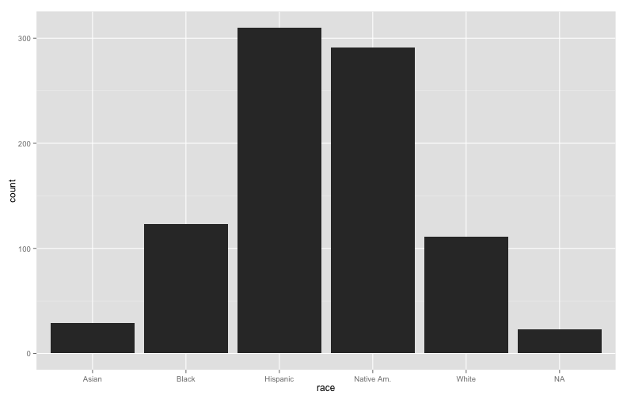

---


```r
qplot(race, fill = race, data = myData)
```


---


```r
qplot(race, fill = race, facets = . ~ grade, data = myData)
```

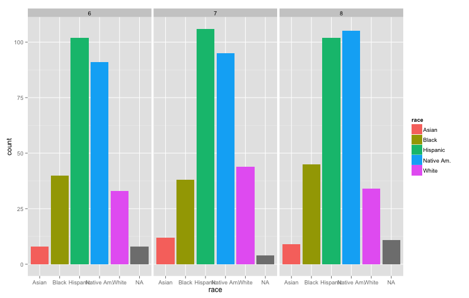

---


```r
qplot(race, fill = race, facets = . ~ female, data = myData)
```

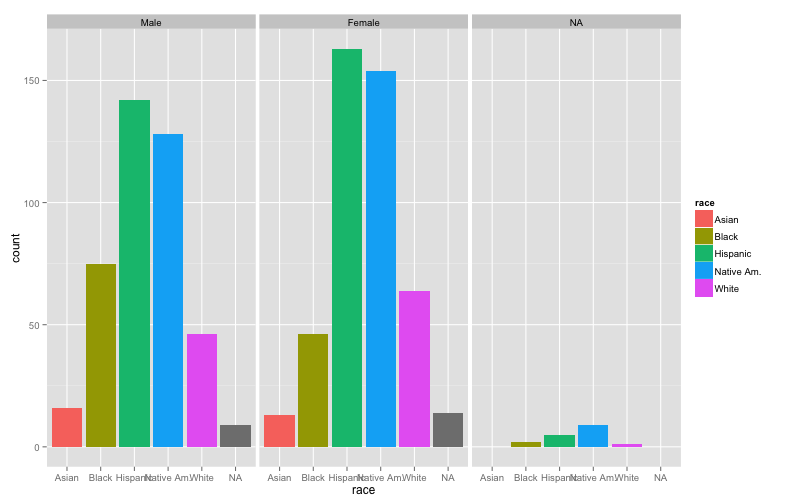

---


```r
qplot(race, fill = race, facets = . ~ homeless, data = myData)
```

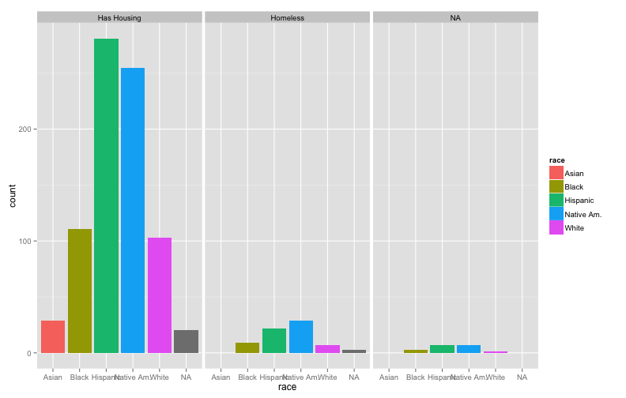

---


```r
qplot(race, fill = race, facets = . ~ lep, data = myData)
```

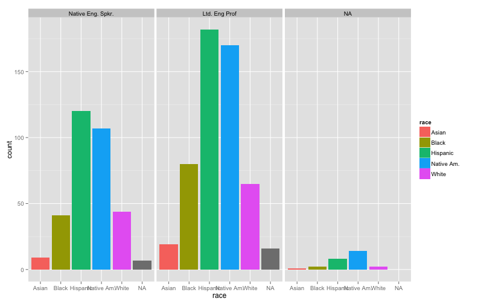

---


```r
qplot(race, fill = race, facets = . ~ sped, data = myData)
```

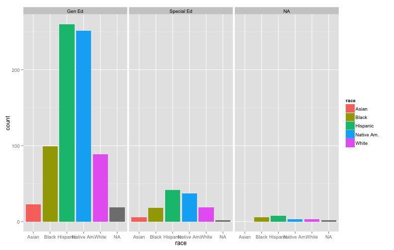

---


```r
qplot(race, fill = race, facets = . ~ frl, data = myData)
```

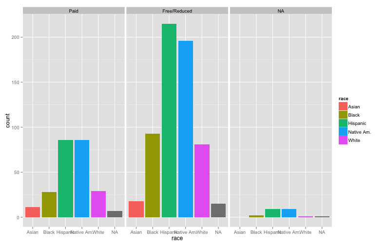

---


```r
qplot(race, fill = frl, facets = . ~ female, data = myData)
```

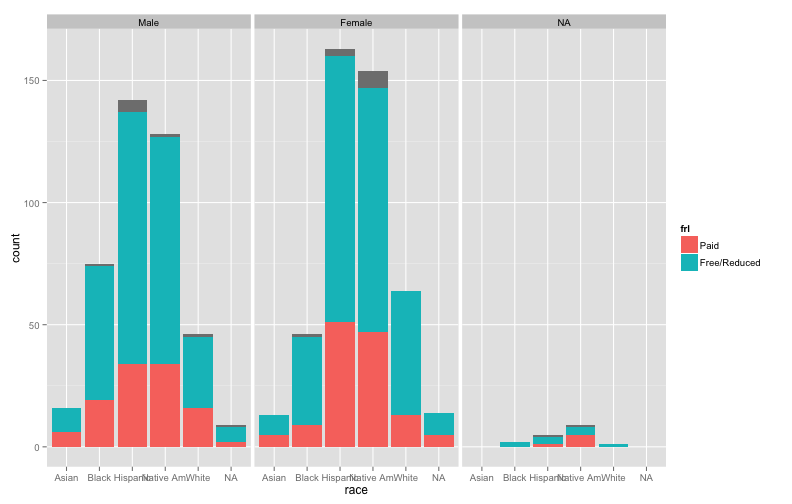

---


```r
qplot(race, fill = frl, facets = tchid ~ female, data = myData)
```

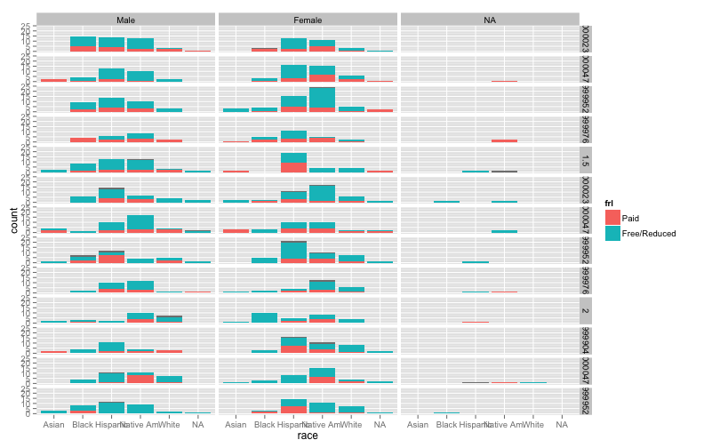

---

# Graphing Ordinal Data 
* The only difference between nominal and ordinal data, is that you would want to avoid using pie graphs for ordinal data at all costs
* A good graph for Ordinal data will also show the order of the values (e.g., as you move to the right on the x-axis the values should represent the increasing amounts)

---   


```r
qplot(elalboy, fill = elalboy, data = myData, #
main = "Beginning of Year: \nELA Proficiency Levels")
```

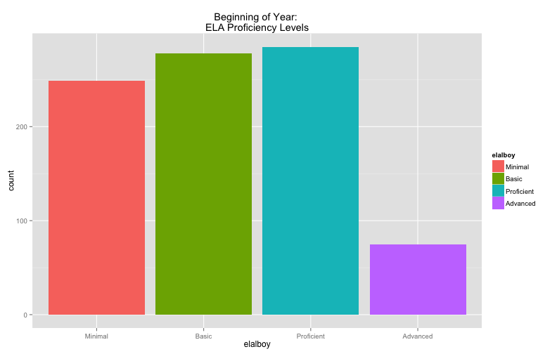

---   


```r
qplot(mthlmoy, fill = mthlmoy, data = myData, #
main = "Middle of Year: \nMath Proficiency Levels", #
ylab = "# of Students Per \nProficiency Level")
```

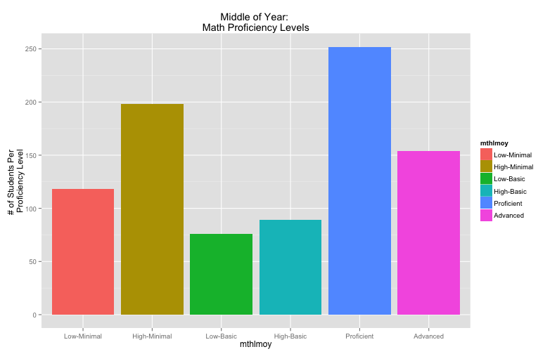

---   


```r
qplot(mthleoy, fill = mthleoy, facets = frl ~ ., #
data = myData, main = "End of Year: \nMath Proficiency Levels", #
ylab = "# of Students Per \nProficiency Level", #
xlab = "Split Proficiency Levels for MSAS Growth")
```

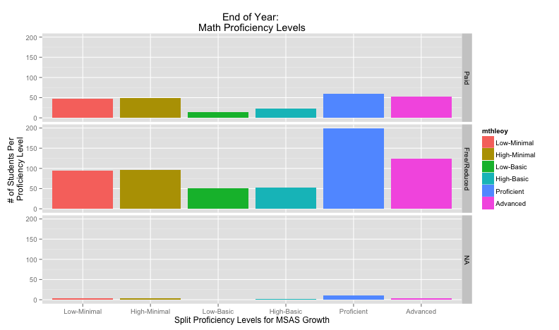

---   

# Graphing Intervallic/Ratio Data 
* Now we no longer have nice and neat categories to use, and the questions that we want to answer are a bit different from when we were working with categorical data
* The most important thing we need to find out is the "shape" or "distribution" of the values (e.g., the # of observations at each value of the variable)

---   


```r
qplot(elamoy, data = myData, geom = "histogram", na.rm = TRUE, #
binwidth = 10, ylab = "# of Students per Score", #
main = "Middle of Year ELA : \nBinwidth set to 10", #
xlab = "Middle of Year \nEnglish/Language Arts Scores")
```

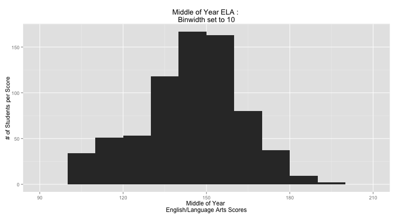

---


```r
qplot(elamoy, data = myData, geom = "histogram", na.rm = TRUE, #
binwidth = 5, ylab = "# of Students per Score", #
main = "Middle of Year ELA : \nBinwidth set to 5", #
xlab = "Middle of Year \nEnglish/Language Arts Scores")
```

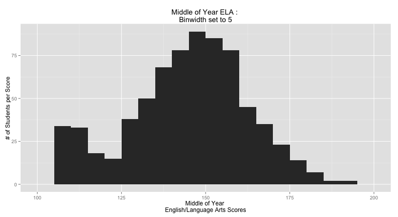

---


```r
qplot(elamoy, data = myData, geom = "histogram", na.rm = TRUE, #
binwidth = 2, ylab = "# of Students per Score", #
main = "Middle of Year ELA : \nBinwidth set to 2", #
xlab = "Middle of Year \nEnglish/Language Arts Scores")
```

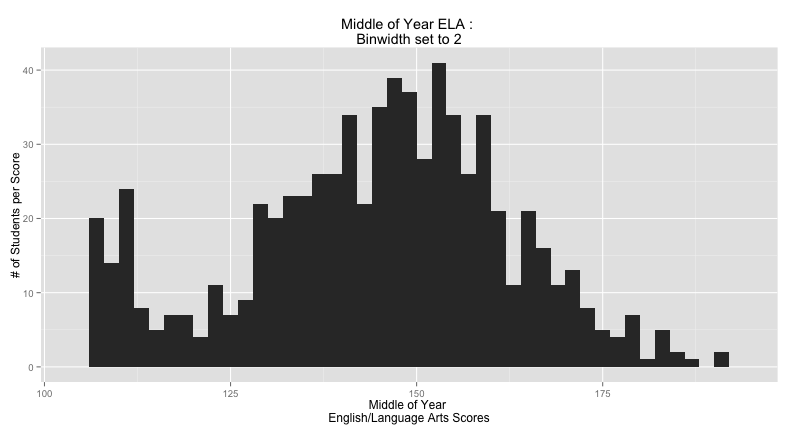

---


```r
qplot(elamoy, data = myData, geom = "histogram", na.rm = TRUE, #
binwidth = 1, ylab = "# of Students per Score", #
main = "Middle of Year ELA : \nBinwidth set to 1", #
xlab = "Middle of Year \nEnglish/Language Arts Scores")
```

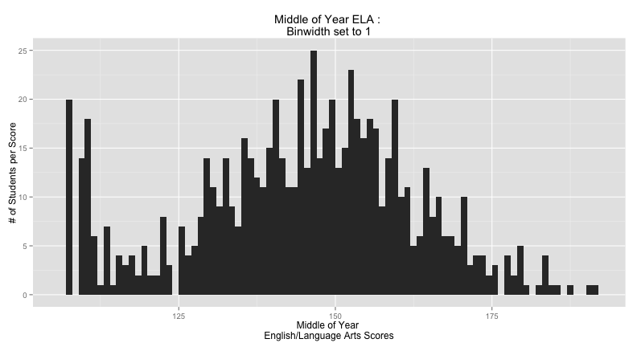

---


```r
qplot(mtheoy, data = myData, geom = "density", #
na.rm = TRUE, main = "End of Year : \nMath Scores", #
xlab = "Math Scaled Scores", ylab = "Density of Observations")
```

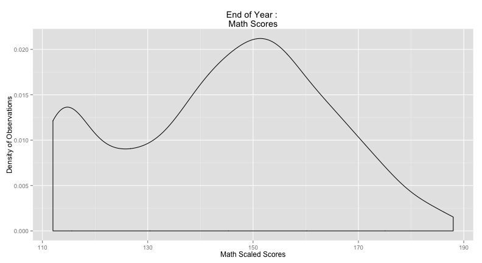

---


```r
qplot(mtheoy, fill = female, data = myData, geom = "density", #
na.rm = TRUE, main = "End of Year : \nMath Scores by Sex", #
xlab = "Math Scaled Scores", ylab = "Density of Observations")
```

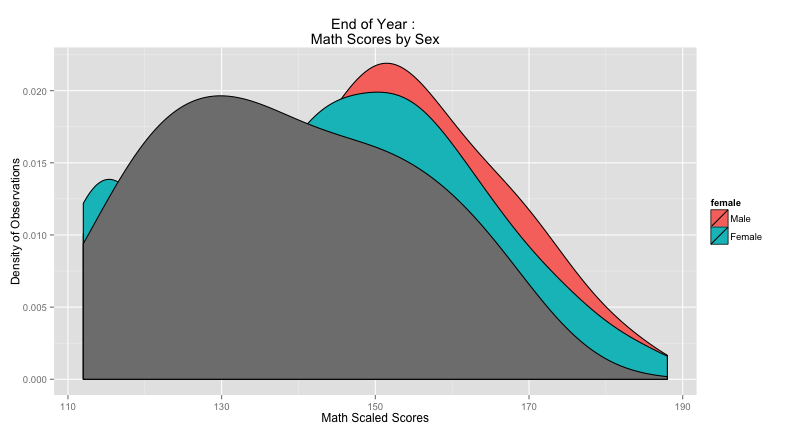

---


```r
qplot(mtheoy, fill = female, alpha = I(0.35), data = myData, #
geom = "density", na.rm = TRUE, #
main = "End of Year : \nMath Scores by Sex", #
xlab = "Math Scaled Scores", ylab = "Density of Observations")
```

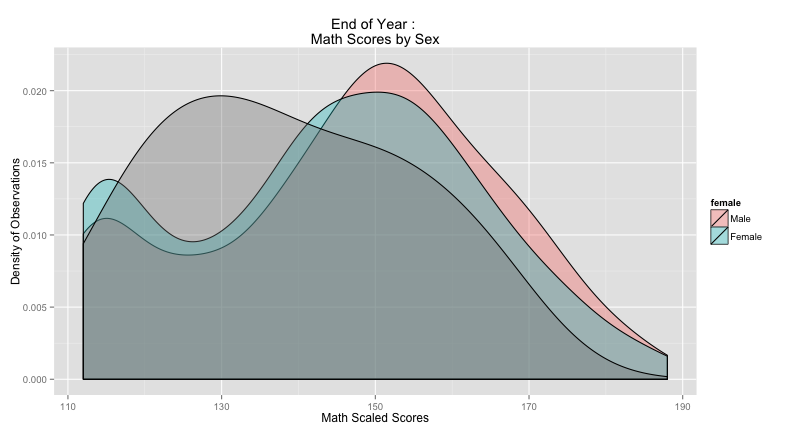

---


```r
qplot(mtheoy, fill = female, alpha = I(0.35), facets = frl ~ ., #
data = myData, geom = "density", na.rm = TRUE, #
main = "End of Year : \nScores by Sex and Free/Reduced Lunch", #
xlab = "Math Scaled Scores", ylab = "Density of Observations")
```

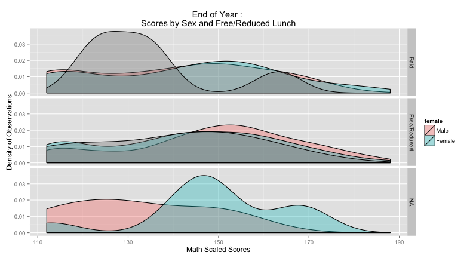

---

## Additional Resources for Learning R
* From the UCLA Statistics Consulting Group
    + [Installing R](http://www.ats.ucla.edu/stat/r/icu/)
    + [R Intro](http://www.ats.ucla.edu/stat/r/seminars/intro.htm)
    + [Starter Kit](http://www.ats.ucla.edu/stat/r/sk/)
    + [Data Visualization](http://www.ats.ucla.edu/stat/r/gbe/default.htm)
    + [Learning Modules](http://www.ats.ucla.edu/stat/r/modules/)
    + [Code Fragments](http://www.ats.ucla.edu/stat/r/code_fragments.htm)
    + [Frequently Asked Questions About R](http://www.ats.ucla.edu/stat/r/faq/default.htm)
* From an R Example website
    + [Some Short Tutorials](http://www.statmethods.net)
* [Resources Recommended by a Highly Respected Statistician](http://andrewgelman.com/2010/06/03/how_best_to_lea/)

---

## Additional Resources for Learning R (cont.)
* From Princeton's Statistics Consultants
    + [Intro to R Studio](http://dss.princeton.edu/training/RStudio101.pdf)
    + [Intro to R](http://data.princeton.edu/R/)
    + [Nice Short Videos Recommended by Princeton](http://www.twotorials.com)
* [R Videos from U Colorado Denver](http://math.ucdenver.edu/RTutorial/)
* Websites used by the R-user Community
    + [R News, Announcements, and Tutorials](http://www.r-bloggers.com)
    + [Statistics Messageboard](http://stats.stackexchange.com/questions/tagged/r)
    + [R Messageboard](http://stackoverflow.com/tags/r)
* [The Website for the Graphics Package We'll be Using](http://ggplot2.org)    

---

# Next Class
* Now that you have an idea of how to create some of these graphs, we will focus a lot more time on interpretation next week as well as other univariate graphing methods
* You should be able to do everything on the slides without a problem if you cut/paste things, but try using them more like a guide (remember the variable names will be the same, but you can always change the name of the data object)
* If you have/find data that you want to be used in the course (must be something publicly available), let me know and we can work with that as well


