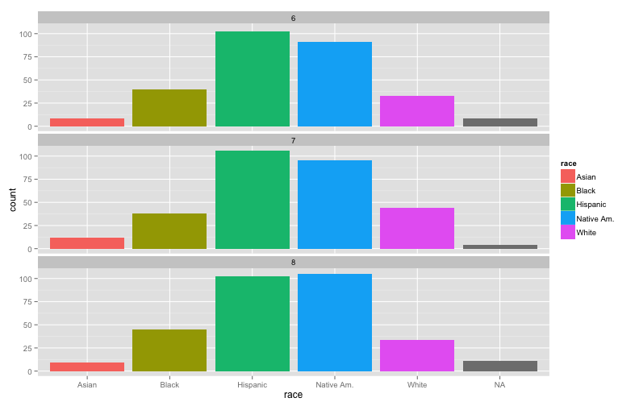
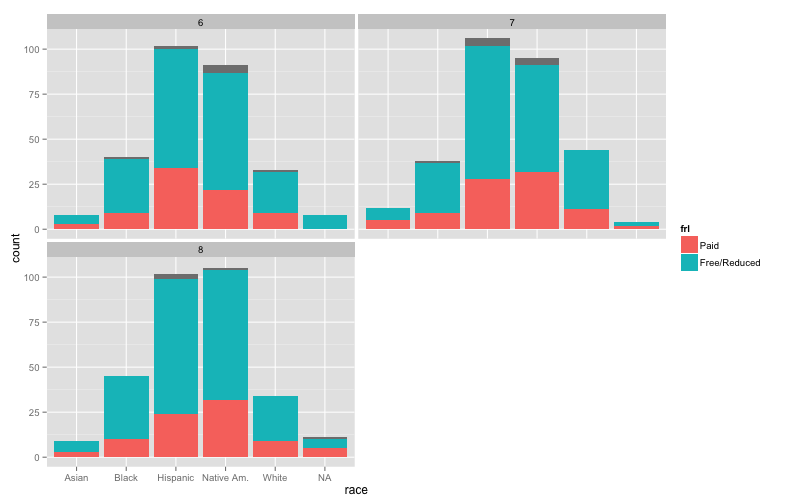
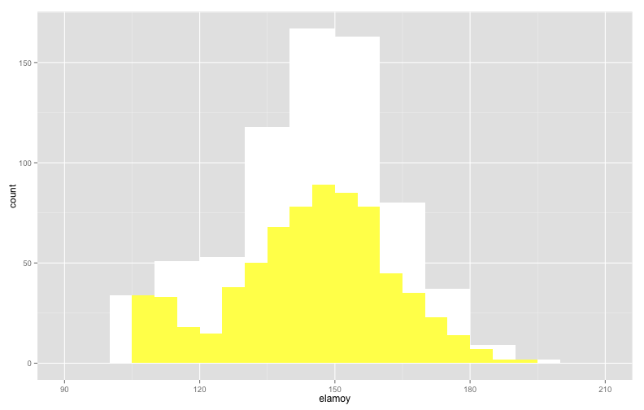
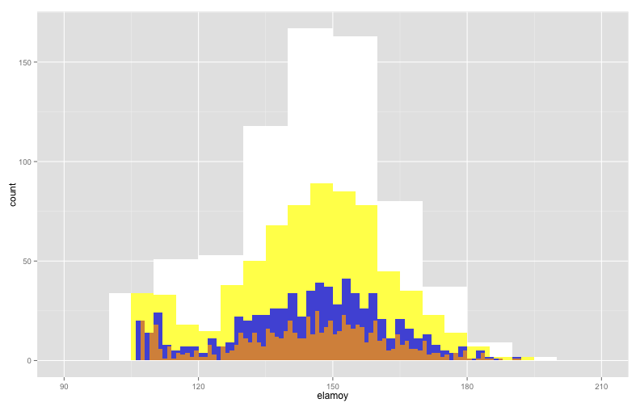
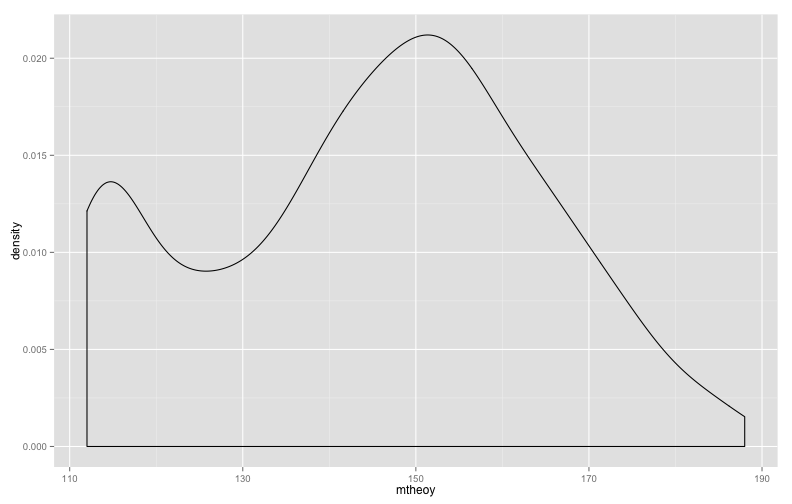
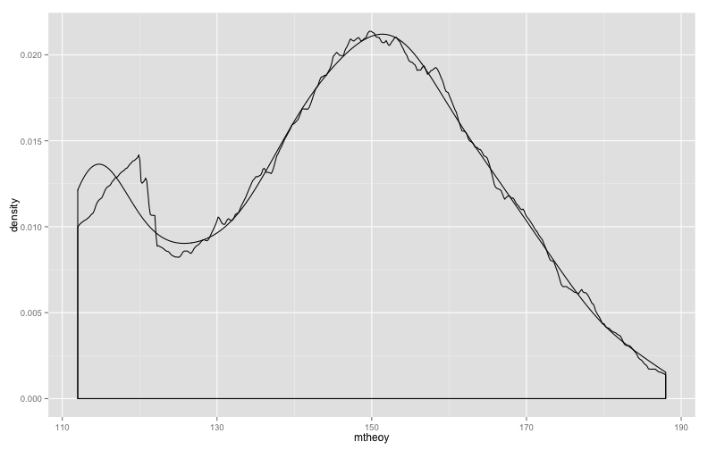
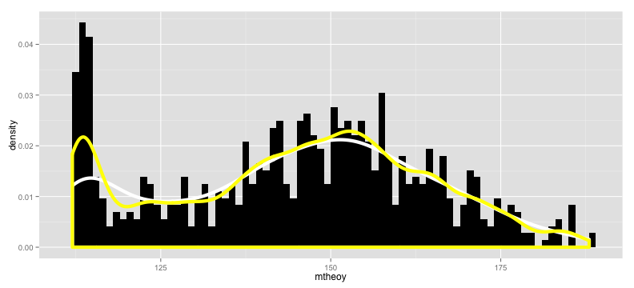

# Overview 
* Review:
    + Some More R Code Tips
    + Measurement Scales
* Creating and Interpreting Univariate Visualizations 
    + Nominal/Ordinal Scale Data
    + Intervallic/Ratio Scale Data
* Preview of First Assignment
    + R Markdown Answer sheet (electronic)
    + R Script Answer sheet (electronic)
* Next class

---

# Review
## Additional Information/Clarification About R
* Anything that appears to the right of the '#' symbol on the same line is ignored
    + theData <- as.data.frame(read.dta(# "filenameIgnored.dta"))
    + theData <- as.data.frame(read.dta(#     
            "filenameNotIgnored.dta"))
    + If the '#' symbol is used to split a command across lines, you should also split the command across lines
* Everything is interpreted literally
    + `library("ggplot2") # Correct`
    + `library("ggplot") # Incorrect`
    + `libary("ggplot2") # Incorrect`
    + `library("ggplot2) # Incorrect`
    + `library(Ggplot2") # Incorrect`
* Type everything exactly as it appears (unless the instructions say otherwise)

---   

# Review
## Additional Information/Clarification About R
* When copying/pasting the code examples from the slides, be careful not to highlight parts of the box around the code.  If you do you'll see a line of '-' across the screen and then you'll get the dreaded '+' cursor in the console window.  
* R Studio will make working with R 1e9 times easier; if the workstation you're sitting at does not have R Studio try to install it, or find a computer that does

---   

# Review
## Additional Information/Clarification About R
* If you download any of the example files you can use `library("foreign"); yourDataObjectName <- as.data.frame(read.dta(file.choose()))` to make a dialog box appear where you can select the file
* If you already have installed a package previously, you only need to use `library("packageName")` to load it; You can try this to see if the package is loaded, and if it isn't you can use `install.packages("packageName", dep = TRUE); library("packageName")` to install and load it
* Read the book.  There is a lot of good information (including step-by-step instructions for downloading and installing R)
* If you need additional practice/getting started with R check out [DataCamp](http://www.datacamp.com)
* You can use the up arrow on your keyboard to bring the previous command back if you need/want to edit/modify things

---

# Review
## Measurement Scales
### Nominal Scale Variabels
* Nominal scales are used to measure unordered categories (e.g., categories where each of the groups are defined to be equivalent)
* R even has a special type of data for these types of variables called FACTOR variables
* Let's create a factor variable to better understand things

---   


```r
# Create a new vector called make that takes values 1-7
make <- rep(seq(1, 7, by = 1), 800)

# Create a cloned version of the make vector called make2 and give it labels
make2 <- factor(make, labels = c("Toyota", "Volvo", "Ford", "Chevrolet", #
                    "BMW", "Saab", "Benz"), levels = c(1:7))

# To see the properties we need to try a few things
table(make); table(make2)
```

```
## make
##   1   2   3   4   5   6   7 
## 800 800 800 800 800 800 800
```

```
## make2
##    Toyota     Volvo      Ford Chevrolet       BMW      Saab      Benz 
##       800       800       800       800       800       800       800
```

---   


```r
# So far so good, everything looks the same, but what if we tried to use a
# math function on the nominal vector?  Any Guesses?
mean(make2)
```

```
## Warning: argument is not numeric or logical: returning NA
```

```
## [1] NA
```

```r
make2[3] == make2[3]
```

```
## [1] TRUE
```

```r
make2[3] != make2[3]
```

```
## [1] FALSE
```

---   

# Review
## Measurement Scales
### Ordinal Scale Variables
* Ordinal scales are used to measure categories where the numbers represent an order of magnitude (e.g., lower value numbers are < higher value numbers)
* Like nominal scale variables, R also has a special data type for ordinal scale variables
* We'll create an example of an ordinal scale variable to better illustrate this

---


```r
# Define a survey response
item1 <- rep(seq(1, 5, by = 1), 200)

# Make this an ordinal scaled variable
item1b <- ordered(item1, levels = c(1:5), #
          labels = c("Strongly Disagree", "Disagree", #
                     "Neither Agree nor Disagree", #
                     "Agree", "Strongly Agree"))

# Check arithmetic operations
item1[2] + item1[3]
```

```
## [1] 5
```

```r
item1b[2] + item1b[3]
```

```
## Warning: '+' is not meaningful for ordered factors
```

```
## [1] NA
```

---   


```r
# Look at tabulations
table(item1)
```

```
## item1
##   1   2   3   4   5 
## 200 200 200 200 200
```

```r
table(item1b)
```

```
## item1b
##          Strongly Disagree                   Disagree 
##                        200                        200 
## Neither Agree nor Disagree                      Agree 
##                        200                        200 
##             Strongly Agree 
##                        200
```

---   


```r
# Test principal feature of oridinal scales (e.g., the values are ordered)
item1b[2] >= item1b[3]
```

```
## [1] FALSE
```

```r
item1b[2] == item1b[3]
```

```
## [1] FALSE
```

```r
item1b[2] != item1b[3]
```

```
## [1] TRUE
```

```r
item1b[1] < item1b[2]
```

```
## [1] TRUE
```

---

# Review
## Measurement Scales
### Intervallic Scale Variables
* Intervallic scales do not include a true zero or do not include zero at all
* We'll create a variable with these properties

---   


```r
# Set the random number seed so you'll generate the same random numbers as
# me
set.seed(7779311)

# Create a new variable with the same scale as a standard IQ test
iq <- trunc(rnorm(1000, mean = 100, sd = 15))

# Show first 10 elements of the IQ variable (vector in R speak)
iq[1:10]
```

```
##  [1]  95  90 136  74  99  99  86 115  99 107
```

---   


```r
# Test for Equivalence
iq[2] != iq[2]
```

```
## [1] FALSE
```

```r
iq[2] != iq[3]
```

```
## [1] TRUE
```

```r
# Test for order of magnitude
iq[2] < iq[3]
```

```
## [1] TRUE
```

```r
iq[5] >= iq[6]
```

```
## [1] TRUE
```

---   


```r
# Test for arithmetic operations
iq[2] + iq[3]
```

```
## [1] 226
```

```r
iq[87] - iq[25]
```

```
## [1] -7
```

---

# Review
## Measurement Scales
### Ratio Scale Variables
* Ratio scales include a true zero and all arithmetic operations can be used with them
* We'll create a new variable with the number of absensces for a group of students

---   


```r
# Create a variable/vector with the number of absences over the year for
# students
absences <- rpois(500, 4)

# List the first 20 elements of the variable
absences[1:20]
```

```
##  [1] 1 4 4 5 3 1 8 1 0 5 9 2 7 6 4 3 2 6 1 3
```

---   


```r
# Test whether or not seventh data element is twice as large as first
absences[7]/2 == absences[1]
```

```
## [1] FALSE
```

```r
# Test arithmetic property of zero
absences[7] + absences[6]
```

```
## [1] 9
```

```r
absences[7] + absences[5]
```

```
## [1] 11
```

---

# Univariate Data Visualization
* We'll use the same example data from last week.  Use the code below to load the libraries that you'll need as well as to get the data loaded

```r
# Need the foriegn package to use sample data and ggplot2 for the graph commands
library("foreign"); library("ggplot2")

# Download/load the sample data from my server
myData <- as.data.frame(read.dta( # Don't put the URL on this line 
        "http://www.paces-consulting.org/mde/data-wrkshp4-843.dta"))

# If you want to download the file to your computer instead do this:
download.file("http://www.paces-consulting.org/mde/data-wrkshp4-843.dta", #
              "exampleDataFile.dta")

# Force a dialog box to popup so you can find the file on the computer
# myData <- as.data.frame(read.dta(file.choose()))
```

---

# Recap of Measurement Scales
## Summary of Numeric Properties of Meaasurement Scales
* Nominal scale variables can only be treated as TRUE or FALSE
    + This means you can compare whether or not one category is the same as another 
    + For example, Ford != BMW is true but Ford == BMW is false
* Ordinal scale variables provide additional mathematical properties beyond the nominal scale
    + Ordinal scale variables have all of the properties of nominal scale variables 
    + You can also compare whether one value is less than or greater than another value  
* Nominal and Ordinal scale variables are sometimes grouped together and called "Categorical" variables

---   

## Summary of Numeric Properties of Meaasurement Scales (continued)
* Intervallic scale variables give us even a bit more flexibility
    + In addition to the properties above, we can use basic arithmetic with intervallic scale variables
    + Intervallic scales lack a true zero
    + So we can compare equality, magnitude, and do basic arithmetic wiht the values
* Ratio scale variables are what you would probably think of instinctively because of how we are typically taught
    + In addition to all of the previous properties, ratio scales support claims about multiplicative rules/difference (e.g., x is twice as much as y) and include a real zero
* What does this mean for graphs ?

---  

# Creating and Interpreting Univariate Visualizations
* This week we'll be using different commands from the ggplot2 package to better illustrate how graphs are constructed, why we use certain types of graphs for specific data types, and how these things come together to guide our interpretation of the data
     + The commands can get a bit complex, but they force you to think explicitly about what you are constructing, why you are constructing it, and how you want your audience to interpret the results
* The first thing to understand is what the `ggplot2` library does and why it does things that way
* It isn't liste in the course reading, but be sure to read the R's Souls' Tip 3.13 on page 102 of the text.  
* Be sure to ask any questions you have about the first assignment templates ASAP
* Reminder, next week we will not be meeting here as I'll be out of town.  Any additional reading you may need will be posted to the blackboard site.

---

# Creating and Interpreting Univariate Visualizations
## The Grammar of Graphics
* The `ggplot2` package is an attempt to directly implement a theory of how graphs should be constructed based on the work of Leland Wilkinson 
* In his "grammar" Wilkinson splits graphs into several different layers, but those which you need to understand the most are: data, geometry, scale, aesthetics, and statistics
* Data visualizations, generally, are ways that we summarize statistical results so part of what we need to understand about visualizations are what the statistics behind them tell us
* The "grammar" described above makes it much easier to disect graphics in a systemic way and to understand how these different parts work together
* We won't recreate all of the graphs from last week, but we will recreate several of them to help you to discuss the meaning of the graphs in class

---

# Graphing Nominal/Ordinal Data 

```r
# Store the data for the graphs in an object & identify the x-axis variable
theGraphData <- ggplot(myData, aes(x = race))

# ggplot() is the function that you will use to define the data you will use
# and the variable that you would like to create a graph for

# myData is the data object with your data

# aes() is the aesthetics function of ggplot

# x = is the argument to set the x-axis to represent a varible we choose

# dataForYourGraph <- ggplot(yourData, aes(x = variableYouWantToGraph))

# Saving this in an object prevents you from retyping the information over
# and over again
```

---   


```r
# Now add some geometry to this and...
theGraphData + geom_bar()
```


---   


```r
# And if we want colored bars we can add an aesthetic option to the
# geometries
theGraphData + geom_bar(aes(fill = race))
```


---


```r
# If you wanted to start faceting the graph you could add information about
# how the data will be faceted
theGraphData + geom_bar(aes(fill = race)) + facet_wrap(~grade)
```


---


```r
# You could specify how you wanted to facets to appear as well
theGraphData + geom_bar(aes(fill = race)) + facet_wrap(~grade, nrow = 3)
```



---


```r
# We can map the color fill of the bars to a different variable to produce
# stacked bar graphs as well
theGraphData + geom_bar(aes(fill = frl)) + facet_wrap(~grade, nrow = 2)
```



---

## Interpretting nominal/ordinal scale variable graphs
* In each of these cases, the bars show the number of observations/records (e.g., students) that have a specified value of race
     + In the first two examples, that is the only variable shown
     + In subsequent examples, the same statistical result is shown, but we parse the data based on other features (e.g., grade level, free/reduced price lunch status, etc...)
* Find someone next to you to discuss the questions on the next slide with

---   

## Interpretting nominal/ordinal scale variable graphs (discussion questions)
* How easy were the stacked bar graphs for you to interpret? 
     + Next we will compare the last graph you saw with a different graph
     + If you have the last graph we did up on your computer, leave it there as a point of reference
     + Take a few minutes to talk with the students around you and try to answer the following questions:
     1. Do the graphs show the same information or different information?
     2. Which graph is easier to interpret (ignoring size of the graphic at the moment)?  Why?
     3. If you had to explain what the graph showed to a parent, what would you say?

---   


```r
# Graph for comparison
theGraphData + geom_bar(aes(fill = race)) + facet_wrap(frl ~ grade, nrow = 3)
```


---

## Interpretting nominal/ordinal scale variable graphs (continued)
* Which graph did you find easier to interpret and why?
* For any type of bar graph, the only interpretable feature is the height (for vertical bars) or width (for horizontal bars) of the bars
    + Sometimes people will use bar graphs to show scalar (single number) values (e.g., the average of a variable, the median of a variable, etc...)
    + In those cases, it is still the height/width of the bar that needs to be interpreted, but the value itself has a different meaning
* While bar graphs showing proportions/percentages are used relatively frequently, they require a bit more work than tables of simple counts
* Remember that you want ordinal graphs to also show the ordering of the values (e.g., you wouldn't graph the MCT2 proficiency levels as proficient, minimal, basic, advanced because it distorts the ordered nature of the data)

---   

# Graphing Intervallic/Ratio Data 
* Because intervallic and ratio scale variables have distinctly different mathematical properties, we need to visualize them a bit differently
* Since the commands we are using from `ggplot2` this week are more flexible, we can do a bit more to show some of the things we were discussing last week
    + For example, we can layer multiple graphs on top of one another to see/show how the parameters change values
    + We can layer different types of graphs on top of each other to examine the similarities and differences between the graph types
* Unlike graphs for nominal/ordinal scale variables, now we also need to interpret our x-axis based on it's set of values

---   


```r
# Create a new object to store your intervallic/ratio scale data for the
# graphs and identify the x-axis variable
theGraphData <- ggplot(myData, aes(x = elamoy))

# Now add some geometry to this and...
baseHistogram <- theGraphData + geom_histogram(binwidth = 10, fill = "White")

# geom_histogram() is the function use to generate a histogram with our data

# binwidth = specifies how many values each bar should take up

# fill = allows us to control the color of the bars in the histogram
```

---   


```r
# You probably are wondering where the graph is...if you want to see it
# enter
baseHistogram
```


---


```r
# Now we'll add a new layer with half the binwidth
baseHistogram.2 <- baseHistogram + #
        geom_histogram(binwidth = 5, fill = "Yellow", alpha = I(0.75))

# baseHistogram is the first histogram we created

# This time we add a new layer to an existing graph

# We use half the bandwidth as the previous graph and use yellow bars

# alpha = I() is a function to set the level of transparency
# 0 is completely transparent and 1 is completely opaque
```

---   


```r
# Again, if you want to see the graph, just enter the name of the object
baseHistogram.2
```



---


```r
# Now we'll add a new layer with half the binwidth
baseHistogram.3 <- baseHistogram.2 + #
    geom_histogram(binwidth = 2, fill = "Blue", alpha = I(0.75))

# Now we just added another layer to the graph that already has two layers

# This time the bars will be blue and only 2 points wide each
```

---   


```r
# Again, if you want to see the graph, just enter the name of the object
baseHistogram.3
```


---


```r
# Now we'll add a new layer with half the binwidth
baseHistogram.4 <- baseHistogram.3 + #
    geom_histogram(binwidth = 1, fill = "Orange", alpha = I(0.75))

# And now we added a fourth layer with orange bars that are 1 point wide
```

---


```r
# Here is the combination of all the different histograms from last week
# layered on top of each other
baseHistogram.4
```



---

## Interpretting intervallic/ratio scale variable graphs (pt 1)
* In each of the histograms, the height of the bar is still telling you information about the density of observations (e.g., the number of observations that have a specific value for that variable)
* The major difference is that our x-axis now has values on a scale with numeric meaning (e.g., we can interpret the meaning of a score of 130 on a test, whereas a value of 3 for race would not be interpretable without knowing how the data were coded)

---   

## Interpretting intervallic/ratio scale variable graphs (pt 1) - Discussion
* Take a few minutes to talk with a different neighbor about what you notice about the different layers of the graphs:
    + Which graph provides the best/worst resolution on the data (e.g., which one is the clearest in terms of showing the number of observations taking a particular value)?  Why?
    + How does changing the bandwidth distort and/or refine our picture of the data?
    + What would you propose as a good rule for choosing the bandwidth to graph the data?
    + People often refer to the Gaussian distribution as the "bell curve."  Do these data fit that shape?  Why/why not?
* After we finish this we'll take a short break (e.g., 5-10 minutes) and then will wrap up the last bit of things

---


```r
# Create an object to store the data for the graphs and identify the x-axis
# variable
theGraphData <- ggplot(myData, aes(x = mtheoy))
```

---   


```r
# Create a simple density plot
theGraphData + geom_density()
```



---


```r
# What would the density look like with a different kernel density
# estimator?
theGraphData + geom_density() + geom_density(kernel = "rectangular")
```



---


```r
# We can also change the bandwidths of the different kernel density estimators
theGraphData + geom_density(adjust = .75) + #
geom_density(kernel = "rectangular", adjust = .25)
```


---


```r
# So what do density plots really show us?
theGraphData + #
geom_histogram(binwidth = 1, fill = "Black", aes(y = ..density..)) + #
geom_density(color = "White", size = 2) + #
geom_density(adjust = .5, color = "Yellow", size = 2)
```



---

## Interpretting intervallic/ratio scale variable graphs
* Explain what the density plot does in your own words.
* Is it easier, more difficult, or about the same to interpret histograms or density plots?
* Why would you use a density plot?

---

# Preview of first assignment
* One of the first things you should do is download and look over the dataset documentation

```r
# Set the working directory for your computer (it will look different from
# mine)
setwd("/Users/billy/Desktop")

# Store the link in an object
url <- "http://www.paces-consulting.org/stata/JSU/Fall2014/task1-documentation.txt"

# Download the dataset documentation
download.file(url, "task1-documentation.txt", method = "curl")
```
* If you want to view the file in R use `readLines("task1-documentation.txt")`

---   

# Preview of first assignment (continued)
* You can also load your data directly from the same server if you don't want to download it from BlackBoard
* First - Load the foriegn data library
    + `library("foreign")`
* Next - Use your First and Last name the same way you see JohnDoe below
    + `yourData <- as.data.frame(read.dta( # `
    
        `"http://www.paces-consulting.org/stata/JSU/Fall2014/JohnDoe-task1.dta"))`

---

# Preview of first assignment
## R Markdown Answer sheet
* This is the file format used to generate the slides for the course
* You can see it does a pretty decent job of keeping the code, graphs, and comments together in a single place
* Everything is set up for you for this first assignment to make it easier for you to work on generating the graphs and writing up your interpretations
    + Test your code in the console window before entering it into your answer sheet (this way you'll know that it works)
    + Make sure that you load any packages you need to do the work
    + Use the slides from this week and last week to give you some idea of how to approach working with the data
    + Make sure to look at the codebook document to understand what the data in your file are
* If you've followed my advice, this assignment should not take you long to complete
* If you've not been reviewing things and trying to replicate them on your own, it will be difficult for you

---   

# Preview of first assignment
## R Script Answer sheet
* This is nearly identical to the R Markdown document
    + The biggest difference for you is that you'll need to enter "#" before each line of your comments/interpretation
    + The biggest difference for me is that I won't be able to look at an HTML formatted document with all of your code, comments, and graphs
    + I cannot encourage you enough to do the work in R Studio using the R Markdown document
    + The R Markdown answer sheet will provide you with output that you can share with others to show them your ability to do the work and provide step by step instructions for them to replicate it with their own data
* Make sure to use a plain text editor when working with this file (e.g., DO NOT USE Word Processing programs)

---   


# Next class
* Reminder (again) : Class will not meet next week, but you will need to turn in the assignment before midnight
* Make sure you are doing the readings
    + I work under the assumption that you are doing the readings
    + That means if I think the book did a good job covering something, I will assume you understand it (because you've read it and not asked any questions on the discussion board about it) and that you are perfectly comfortable with the material
    + The department is working with the book store to figure out what happened with the book and ordering things
    + If you don't understand the reading(s) and/or are having difficulties working through the examples post a question to the discussion board and ask for help
* Unless we've made prior arrangements the work is due when it is due.
