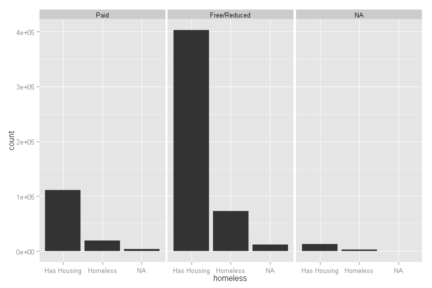

# Univariate Data Visualization
ASSIGNMENT EXAMPLE  
DUE BY: September 16, 2014 AT 11:59pm  

# Instructions
1. Download your data set from Blackboard onto your computer and load the dataset into R
2. Get the information you will need from the data set in order to determine what types of graphs are best for the data
3. Create 2 graphs for nominal scale variables and include a short interpretation of the results
4. Create 2 graphs for ordinal scale variables and include a short interpretation of the results
5. Create 2 graphs for intervallic scale variables and include a short interpretation of the results
6. Create 1 graph for a ratio scale variable and include a short interpretation of the results

## Additional Info
* Think of this document like an answer sheet if you are using R Studio, If not download the R script and use that instead
* Once you've added all of your answers to the document save it and upload the file to blackboard before the due date/time
* I've gone through and set up the majority of this document for you so you don't need to worry about learning the formatting stuff right away
    + You will need to be comfortable extrapolating from here for future assignments to generate the formatting
    + I will provide you with an even more minimalist shell, but everything that you would need to know/do is already included here
* You can either submit this document for your grade OR you can submit an R script using comments for your written interpretation.
    + If you submit a file created in MS Word it will NOT BE GRADED
    + If you submit a file in any other format other than those specified above and in the syllabus IT WILL NOT BE GRADED
    + Your file must be named with the following naming convention: 'FirstLast-Task1.Rmd' if using this template or 'FirstLast-Task1.R' if using a regular R script.  Substitute your first and last names where you see FirstLast above; do not add spaces to the file name, it causes delays in everyone getting their work back.
* You can ask classmates for help with the coding aspects of the assignment 
    + If you need to ask for help, post it to the Blackboard website because someone else probably has the same question
* You CANNOT share your interpretation of the results with anyone; if there is evidence that this happened it will be turned over to Dr. Smith immediately

# . Get the information you will need from the data set in order to determine what types of graphs are best for the data


```r
# Load the package you need to read the data file provided
library("foreign")

# Enter the code that you used to load your data below
exampleData <- as.data.frame(read.dta("http://www.paces-consulting.org/mde/data-wrkshp4-584.dta"))

# Display the names of the variables in your dataset
names(exampleData)
```

```
##  [1] "schid"      "tchid"      "msis"       "grade"      "female"    
##  [6] "frl"        "homeless"   "lep"        "race"       "sped"      
## [11] "scd"        "elaboy"     "elalboy"    "elamoy"     "elalmoy"   
## [16] "elaeoy"     "elaleoy"    "elagrade"   "mthboy"     "mthlboy"   
## [21] "mthmoy"     "mthlmoy"    "mtheoy"     "mthleoy"    "mthgrade"  
## [26] "absence"    "detention"  "suspension" "tardy"
```

```r
# Generate the summary statistics for the variables in the dataset
summary(exampleData)
```

```
##         schid            tchid           msis               grade  
##  School 123:  4459   Min.   :  1.1   Length:637562      Min.   :6  
##  School 49 :  4434   1st Qu.: 39.4   Class :character   1st Qu.:6  
##  School 74 :  4434   Median : 76.2   Mode  :character   Median :7  
##  School 104:  4434   Mean   : 76.2                      Mean   :7  
##  School 120:  4416   3rd Qu.:113.0                      3rd Qu.:8  
##  School 53 :  4415   Max.   :151.3                      Max.   :8  
##  (Other)   :610970                                                 
##     female                 frl                homeless     
##  Male  :303609   Paid        :133374   Has Housing:527214  
##  Female:317914   Free/Reduced:488076   Homeless   : 94307  
##  NA's  : 16039   NA's        : 16112   NA's       : 16041  
##                                                            
##                                                            
##                                                            
##                                                            
##                 lep                 race                sped       
##  Native Eng. Spkr.:227303   Asian     : 53008   Gen Ed    :523485  
##  Ltd. Eng Prof    :394342   Black     :163673   Special Ed: 98017  
##  NA's             : 15917   Hispanic  :216983   NA's      : 16060  
##                             Native Am.:145325                      
##                             White     : 42506                      
##                             NA's      : 16067                      
##                                                                    
##       scd             elaboy             elalboy           elamoy      
##  Not SCD:627271   Min.   : 96      Minimal   :182030   Min.   :107     
##  Is SCD : 10291   1st Qu.:134      Basic     :190765   1st Qu.:133     
##                   Median :145      Proficient:204553   Median :145     
##                   Mean   :144      Advanced  : 60214   Mean   :144     
##                   3rd Qu.:156                          3rd Qu.:157     
##                   Max.   :191                          Max.   :191     
##                   NA's   :130382                       NA's   :116454  
##        elalmoy           elaeoy            elaleoy          elagrade
##  Minimal   :172949   Min.   :104     Minimal   :162910   Min.   :5  
##  Basic     :182079   1st Qu.:133     Basic     :179392   1st Qu.:6  
##  Proficient:218712   Median :146     Proficient:220757   Median :7  
##  Advanced  : 63822   Mean   :144     Advanced  : 74503   Mean   :7  
##                      3rd Qu.:157                         3rd Qu.:8  
##                      Max.   :189                         Max.   :9  
##                      NA's   :80905                                  
##      mthboy              mthlboy           mthmoy      
##  Min.   : 88     Low-Minimal : 65437   Min.   :104     
##  1st Qu.:134     High-Minimal:169411   1st Qu.:134     
##  Median :147     Low-Basic   : 55821   Median :147     
##  Mean   :144     High-Basic  : 62259   Mean   :144     
##  3rd Qu.:158     Proficient  :176862   3rd Qu.:158     
##  Max.   :187     Advanced    :107772   Max.   :185     
##  NA's   :73810                         NA's   :115889  
##          mthlmoy           mtheoy               mthleoy          mthgrade
##  Low-Minimal : 70427   Min.   :112      Low-Minimal : 83192   Min.   :5  
##  High-Minimal:148199   1st Qu.:133      High-Minimal:125772   1st Qu.:6  
##  Low-Basic   : 56340   Median :147      Low-Basic   : 53585   Median :7  
##  High-Basic  : 60297   Mean   :146      High-Basic  : 54785   Mean   :7  
##  Proficient  :189720   3rd Qu.:160      Proficient  :189838   3rd Qu.:8  
##  Advanced    :112579   Max.   :188      Advanced    :130390   Max.   :9  
##                        NA's   :137454                                    
##     absence     detention       suspension       tardy   
##  Min.   : 0   Min.   : 0.00   Min.   : 0     Min.   : 2  
##  1st Qu.: 5   1st Qu.: 0.00   1st Qu.: 0     1st Qu.:14  
##  Median : 7   Median : 1.00   Median : 0     Median :17  
##  Mean   : 7   Mean   : 1.93   Mean   : 1     Mean   :17  
##  3rd Qu.: 9   3rd Qu.: 3.00   3rd Qu.: 1     3rd Qu.:20  
##  Max.   :23   Max.   :58.00   Max.   :23     Max.   :38  
##                               NA's   :4292
```

```r
# Find out what data types exist in your data
class(exampleData)
```

```
## [1] "data.frame"
```

```r
# Load the library that you need to generate the graphs
library("ggplot2")

# If you want to see the variable labels (e.g., what the variable names
# mean) you can use
attr(exampleData, "var.label")
```

```
##  [1] "School ID #"                                           
##  [2] "Teacher ID #"                                          
##  [3] "Student ID #"                                          
##  [4] "Grade Level of Student"                                
##  [5] "Student's Biophysiological Sex"                        
##  [6] "Economically Disadvantaged Indicator"                  
##  [7] "Student's Housing Status"                              
##  [8] "Student with Limited English Proficiency"              
##  [9] "Student's Race"                                        
## [10] "Student with Disabilities Indicator"                   
## [11] "Severe Cognitive Disability Indicator"                 
## [12] "Beginning of Year - ELA Scaled Score"                  
## [13] "Beginning of Year - ELA Proficiency Levels"            
## [14] "Middle of Year - ELA Scaled Score"                     
## [15] "Middle of Year - ELA Proficiency Levels"               
## [16] "End of Year - ELA Scaled Score"                        
## [17] "End of Year - ELA Proficiency Levels"                  
## [18] "Grade of ELA Assessment Given to Student"              
## [19] "Beginning of Year - Math Scaled Score"                 
## [20] "Beginning of Year - Math Proficiency Levels for Growth"
## [21] "Middle of Year - Math Scaled Score"                    
## [22] "Middle of Year - Math Proficiency Levels for Growth"   
## [23] "End of Year - Math Scaled Score"                       
## [24] "End of Year - Math Proficiency Levels for Growth"      
## [25] "Grade of Math Assessment Given to Student"             
## [26] "# of Times Student Missed School in that Grade"        
## [27] "# of Times Student Sent to Detention in that Grade"    
## [28] "# of Times Student was Suspended in that Grade"        
## [29] "# of Times Student was Late to School in that Grade"
```

# . Create 2 graphs for nominal scale variables and include a short interpretation of the results


```r
# Enter the code to create the graph for your second nominal scale variable
# on the line below
qplot(homeless, facets = . ~ frl, data = exampleData)
```

 
 
## Interpretation of graph for first nominal scale variable
There are almost the same number of students who are homeless and receive free 
lunch as students who pay for lunch and are not homeless.  There are way more 
students receiving free/reduced price lunch than there are students who pay for 
their lunch.

### Quality of interpretation
The quality of the interpretation above was acceptable.  Things that would improve it would be additional precision regarding the comparison of the magnitudes.  For example, the number of students who were both homeless and received free/reduced lunch was approximately 66% that of students who had house and paid for lunch.  The number of students who had housing and received free/reduced price lunch was almost four times greater than the number of students who paid for lunch and had housing.

## Create second nominal scale variable graph


```r
# Enter the code to create the graph for your second nominal scale variable on the line below

# Create a data object with the data required for the graph
nominalGraph <- ggplot(exampleData, aes(x = race))

# Generate the graph
nominalGraph + geom_bar(aes(fill = frl)) + #
    facet_wrap(sped ~ scd, nrow = 3, ncol = 2)
```

 

## Interpretation of graph for second nominal scale variable
Very few students are missing special education status and only students who are
identified for special education are identified as students with severe 
cognitive disabilities.  Of the special education and general education students, 
the special education population is a small fraction, with the greatest number 
of special education students being Black, Hispanic, and Native American.  The 
free/reduced price vs. paid lunch status generally follows the same distribution
across general and special education.

### Quality of interpretation
This would be a much better interpretation than the previous.  Here there is additional detail, analysis, and interpretation of what the graph is attempting to represent.  Given the sample size, it is a bit difficult to interpret things with any additional precision, so that might be something to consider adding to your interpretation as a limitation of the data.

# . Create 2 graphs for ordinal scale variables and include a short interpretation of the results


```r
# Enter the code to create the graph for your first ordinal scale variable
# on the line below
qplot(mthleoy, fill = mthleoy, facets = female ~ ., data = exampleData)
```

 

## Interpretation of graph for first ordinal scale variable
Both of the distributions look the same.  I guess I would say there really aren't 
any big differences between boys and girls on the end of year math proficiency 
levels.

### Quality of interpretation
This would be an example of a poor interpretation.  Would we really expect that more students would score on the higher side of minimal than all of basic combined?  Would we expect that more students scored advanced than basic?  Yes the distributions are fairly similar, but here the real interpretation is about whether or not the data appear to make sense based on our understanding of how test scores are typically distributed.


## Create graph for second ordinal scale variable


```r
# Enter the code to create the graph for your second ordinal scale variable
# on the line below
ordinalGraph <- ggplot(exampleData, aes(x = elalboy))

# Create the graph
ordinalGraph + geom_bar(aes(fill = elaleoy)) + facet_wrap(~sped, ncol = 1)
```

 

## Interpretation of graph for second ordinal scale variable
Students in minimal, proficient, and advanced levels at the beginning of the 
year tended to remain at the same proficiency level at the end of the year.  
Students at basic at the beginning of the year had the most mobility between 
proficiency levels, and students in the advanced proficiency level at the 
beginning of the year tended to not drop below proficient.  There were similar 
patterns for general ed and special ed students, but special ed students did not 
have as much movement into the advanced proficiency level.

### Quality of interpretation
This is a much better interpretation.  It's difficult to see all of the detail for students with disabilities, but there are some things going on in the graph - that were they real - would probably be worth looking into with greater detail.  If students are ending up typically in the same place they started is it due to more of the scores being clustered around the middle of those score ranges or because they truly have not made any progress?  In cases where there is a substantial amount of change (e.g., Gen Ed Basic) Is that change primarily due to more of those students being "bubble" students, or because they were split up and had an equal number of ineffective, average, and highly effective teachers?

# . Create 2 graphs for intervallic scale variables and include a short interpretation of the results


```r
# Enter the code to create the graph for your first intervallic scale
# variable on the line below
qplot(elamoy, geom = "histogram", binwidth = 5, data = exampleData)
```

 

## Interpretation of graph for first intervallic scale variable
The distribution kind of looks like a bell-curve, but there is a big group of 
students at the bottom that stick out.

### Quality of interpretation
This isn't the worst example here, but far from the best.  If each of the bars are 5 points wide, how clear of a picture do you think we are seeing of these data?  What is so important about the group of students that stick out at the bottom that would make you want to say something about it?


## Create Graph for second intervallic scale variable


```r
# Enter the code to create the graph for your second intervallic scale variable on the line below
intervallicGraph <- ggplot(exampleData, aes(x = mthboy))

# Build the graph with layers
intervallicGraph + geom_density(adjust = .25, color = "Blue", size = .25) + #
geom_histogram(binwidth = 10, fill = "White", aes(y = ..density..), # 
    alpha = .35) + geom_density(color = "Orange", size = 1.5)
```

 

## Interpretation of graph for second intervallic scale variable
Here we see that a bin width of 10 for the beginning of year math scores is far too coarse to provide an accurate depiction of the distribution of the data.  Because the blue line represents a the density with a small bandwidth, it's clear that several significant peaks are being masked by the width of the bins in the histogram.  However, the resolution is so precise that it creates peaks that are illogical.  The orange colored density line provides a more reasonable illustration of the distribution of the data elements and provides a better approximation and middle ground to the two previous approaches.  While the data generally follow a Gaussian distribution, an argument could be made based on visual inspection that the data are not normal and symmetrical.

### Quality of interpretation
First, I would not expect you to create a graph like this for this class.  Second, this is here to give you examples of creating different graphs and what the interpretations could look like.  Now, onto the quality of what you see above.  The type of response that you see above is an automatic full-credit.  There is analysis of the data and the mechanics of how the graph was created.  Then, there is additional comparison between the different views of exactly the same data.  


# . Create 1 graph for a ratio scale variable and include a short interpretation of the result


```r
# Enter the code to create the graph for your ratio scale variable on the line below
qplot(suspension, geom = "histogram", binwidth = 1, fill = race, #
      facets = lep ~ sped, data = na.omit(exampleData))
```

 

## Interpretation of graph for ratio scale variable
The majority of the students in this example are students with limited english 
proficiency.  Only a small number of students are in special education, and the 
majority of the racial composition is Hispanic/Latino(a).  Of the students 
suspended multiple times, nearly all were ethnoracial minorities.  This pattern 
held regardless of limited english proficiency status and/or identification 
as a student with disabilities.  Most of the students, in all cases, were 
never suspended.

### Quality of interpretation
This is a decent interpretation.  What else do you think could have been discussed about this graph?
