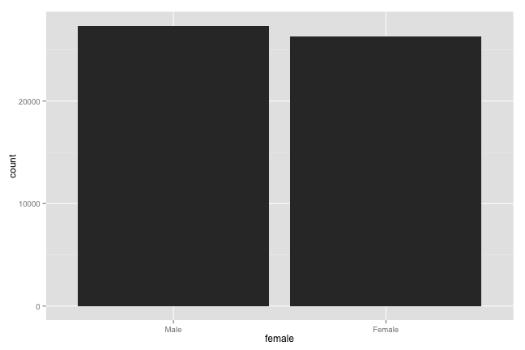
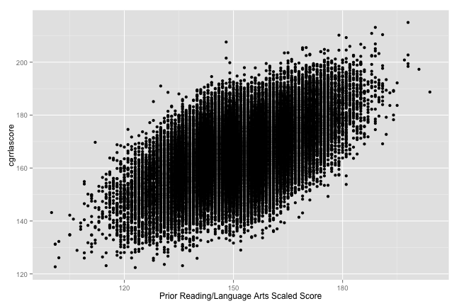
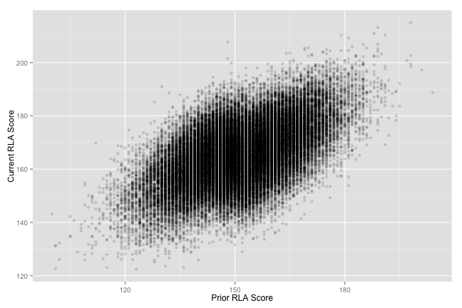
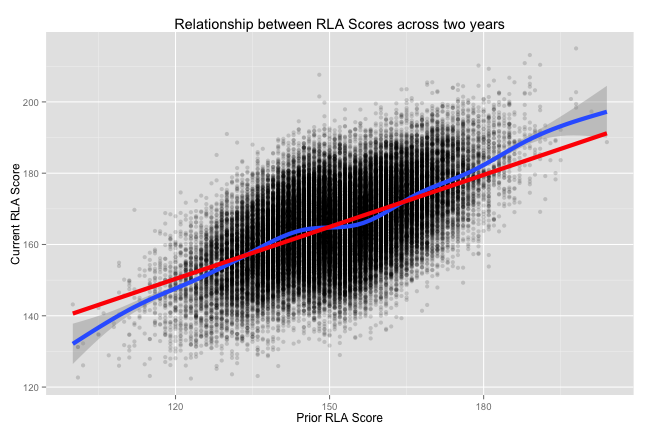
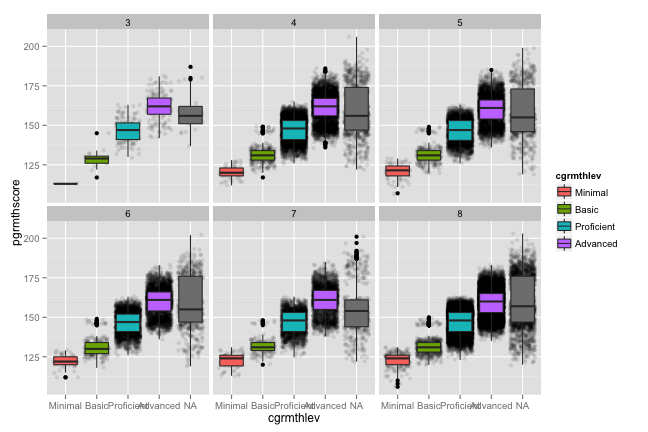
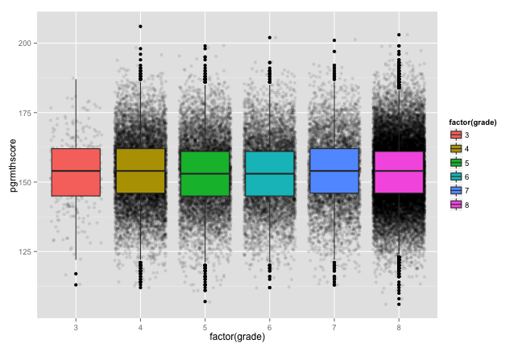
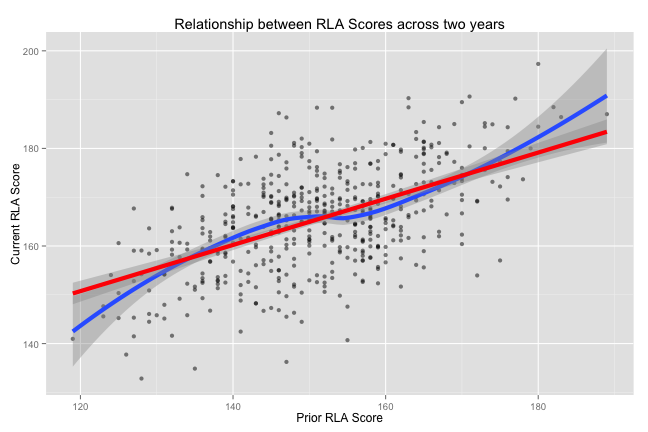

# Overview 
* Review:
    + General reminders
    + First Assignment
* Bivariate Data Visualization 
    + Continuous v Continuous variables
    + Continuous v Categorical variables
* Additional tips
* Next class

---

# Review
## General reminders
* Several students lost points on the assignment for not following directions in the syllabus; if you haven't read through the syllabus you should
* Before submitting any code for your assignment you should be checking to make sure that it does what you intend it to do 
     + I usually will test the code by running it in the console first and then will add it to my script only after checking it
     + If you're copying and pasting from the console remember to remove the `>` and `+` prompts from what you copy and paste
     + If what you're copying is text or a note make sure to include the `#` symbol before that text
* Start new threads on the discussion boards for each unique topic; this makes it easier for everyone to find help
* Although I do not grade grammar or spelling, this is a graduate level course and I expect there to be at least minimal effort on your part to use correct capitalization, complete sentences, etc...

---   

Load the example data set that will be used tonight


```r
# Load the packages needed for the graphs and to read the data
library("foreign"); library("ggplot2"); 

# Read the example data set from my server
johnDoe <- as.data.frame(read.dta( # Don't put the URL on this line 
        "http://www.paces-consulting.org/stata/JSU/Fall2014/JohnDoe-task1.dta"))
```
     
* Looking only at the bars in the next graphs, what differences did you see?
* Looking at the code, what variable is being graphed in the two examples?

---


```r
# Compare this and the next graph
qplot(race, data = johnDoe)
```


---


```r
qplot(race, data = johnDoe, geom = "histogram", na.rm = TRUE, binwidth = 10, 
    ylab = "# of Students per Score", main = "Middle of Year ELA : \nBinwidth set to 10", 
    xlab = "Middle of Year \nEnglish/Language Arts Scores")
```


---


* Keeping in mind that the data for the interpretations below were different what differences do you see in the quality of the interpretations?:
    + "Asians had the lowest scores while African Americans had the higest scores. "
    + "After reviewing the data on the graph it looks as if a majority of the students are black and white. The largest group is black followed by white then there is only a few hispanic."
    + "According to the nominal scale, there are more African American students than any other race in the school."
    + "District has more African-American students than White students and less than or close to 1000 Hispanic or Latino students."
    + "over 200000 scored 0-10"
* Which of these do you feel did the best job?

---


```r
# Look at this graph and compare the interpretations on the next slide
qplot(female, data = johnDoe)
```



---

* Which interpretation do you think deserves a better score?  Why?
     + Males have a higer count than females. 
     + After reviewing the graph the ratio of male to female is close.  But the male population out weighs the female by a few thousand.
     + Based on the graph there are approximately 24,000 male students vs. around 22,000 female students.  The ratio of male to female is pretty evenly distributed with males having a slightly larger number.  As the population is pretty close to 50/50 male to female these results were expected.
* Which interpretation is closest to how you interpreted your graphs?

---

# Review
## First Course Assignment (and some more generalized stuff as well)
* I can bring everyone to the water, but I cannot make anyone drink it
* It is your responsibility as students to ask answerable questions when you do not understand the material
* It is my responsibility to help you find the answers and/or work through the answer when the question is answerable
* If my response to your questions on the discussion board is to review the post that I put up about how to ask questions that can be answered, you should review it and try to frame your question that way 

---  


```r
# This shows you the labels for the variables in the dataset
attr(johnDoe, "var.labels")
```

```
##  [1] "District ID #"                                     
##  [2] "Non-Unique School ID #"                            
##  [3] "Unique School ID #"                                
##  [4] "MSIS Student ID #"                                 
##  [5] "Student's Ethnoracial Identity"                    
##  [6] "Student's Biological Sex"                          
##  [7] "Severe Cognitive Disability Indicator"             
##  [8] "Student Served by Special Education Indicator"     
##  [9] "English Language Learner Indicator"                
## [10] "Limited English Proficiency Indicator"             
## [11] "Migrant Family Indicator"                          
## [12] "Economically Disadvantaged Indicator"              
## [13] "Current Grade Level of the Student"                
## [14] "Current Reading/Language Arts Scaled Score"        
## [15] "Prior Reading/Language Arts Scaled Score"          
## [16] "Current Mathematics Scaled Score"                  
## [17] "Prior Mathematics Scaled Score"                    
## [18] "Current Reading/Language Arts Proficiency Level"   
## [19] "Prior Reading/Language Arts Proficiency Level"     
## [20] "Current Mathematics Proficiency Level"             
## [21] "Prior Mathematics Proficiency Level"               
## [22] "Participated in Reading/Language Arts Intervention"
## [23] "Participated in Mathematics Intervention"
```

---

# Bivariate Data Visualization
## Continuous v Continuous variables
* We've looked at some examples showing the distribution of a single variable so far and even done a bit to show multiple variables simultaneously, but we haven't looked at how multiple continuous variables can be graphed simultaneously
* To do this we need to look at scatterplots
* Scatterplots are no different from when you were in school and learned about x,y coordinate pairs, we just have more information to display

---


```r
# A first example of a scatterplot
qplot(pgrrlascore, cgrrlascore, data = johnDoe)
```


---   

* What do you notice about the shape?
* Is it easy to see all of the points?
* What would you say about the relationship between the two variables
* How can we improve on this graph?

---   


```r
# Add a label to the x-axis for the variable you graph on the x-axis
qplot(pgrrlascore, cgrrlascore, data = johnDoe, #
      xlab = attributes(johnDoe)$var.labels[[15]])
```



---   


```r
# Add labels to both axes for your graph 
qplot(pgrrlascore, cgrrlascore, data = johnDoe, #
      xlab = attributes(johnDoe)$var.labels[[15]], #
      ylab = attributes(johnDoe)$var.labels[[14]])
```


---   

* Yes, the `attributes(johnDoe)$var.labels[[#]]` thing can be confusing
* If you use the `names(johnDoe)` function you can find the number that corresponds to your variable
* Even easier, however, is if you copy and paste the variable labels from the code book on the blackboard site for the dataset
* You could also look at the codebook and create your own labels

---


```r
# Add labels to both axes for your graph 
qplot(pgrrlascore, cgrrlascore, data = johnDoe, #
      xlab = "Prior RLA Score", ylab = "Current RLA Score")
```


---   


```r
# Since there are a lot of points, we could make them semi-transparent 
# to view them a bit more easily
qplot(pgrrlascore, cgrrlascore, data = johnDoe, #
      xlab = "Prior RLA Score", ylab = "Current RLA Score", #
      alpha = I(0.15))
```



---   


```r
# And if we want to highlight the trend in the data, we can add a line of best fit
qplot(pgrrlascore, cgrrlascore, data = johnDoe, #
      xlab = "Prior RLA Score", ylab = "Current RLA Score", alpha = I(0.15)) + #
      geom_smooth(size = 2, method = "lm")
```


---   


```r
# Or we could add a line that can bend and curve to fit the data a bit more
qplot(pgrrlascore, cgrrlascore, data = johnDoe, #
      xlab = "Prior RLA Score", ylab = "Current RLA Score", alpha = I(0.15)) + #
      geom_smooth(size = 2)
```


---   


```r
# Or we could add both types of lines
qplot(pgrrlascore, cgrrlascore, data = johnDoe, #
      xlab = "Prior RLA Score", ylab = "Current RLA Score", alpha = I(0.15)) + #
      geom_smooth(size = 2) + geom_smooth(size = 2, method = "lm", color = "Red")
```


---   


```r
# If this is our final graph, then we probably want to give it a title as well
qplot(pgrrlascore, cgrrlascore, data = johnDoe, #
      xlab = "Prior RLA Score", ylab = "Current RLA Score", #
      main = "Relationship between RLA Scores across two years", alpha = I(0.15)) + #
      geom_smooth(size = 2) + geom_smooth(size = 2, method = "lm", color = "Red")
```



---   

# Bivariate Data Visualization
## Continuous v Categorical variables
* Not all of our data are continuous, and sometimes we can to make broader comparisons
* Boxplots are extremely well suited to providing a ton of information in a way that is fairly easy to interpret
* More importantly is that they can help us to make comparisons about the distributions of data between the groups without really understanding the mechanics of the plot itself
* As an example, go [here](https://wbuchanan.shinyapps.io/EquipercentileLinking/)
* Then click on the percentiles and/or total points tabs and voila...Boxplots

---


```r
# Create a boxplot to look for outliers across districts
ggplot(johnDoe, aes(x = factor(distid), y = cgrmthscore)) + geom_boxplot()
```


---   


```r
# Same thing but this time looking at grade-levels within districts
ggplot(johnDoe, aes(x = factor(grade), y = pgrmthscore)) + #
     geom_boxplot(aes(fill = factor(grade))) + facet_wrap(~distid)
```


---   


```r
# What if we want more detail about the distributions in each of the categories?
ggplot(johnDoe, aes(x = cgrmthlev, y = pgrmthscore)) + #
     geom_jitter(alpha = I(.1)) + geom_boxplot(aes(fill = cgrmthlev)) + #
     facet_wrap(~grade)
```



--- 


```r
# It works for simpler examples as well
ggplot(johnDoe, aes(x = factor(grade), y = pgrmthscore)) + #
     geom_jitter(alpha = I(.1)) + geom_boxplot(aes(fill = factor(grade))) 
```



--- 

# Additional tips
* Something important to remember about Boxplots is that you generally want to use a categorical variable on the x-axis
* You can use `class(dataObject$variableName)` to determine whether or not the variable you are interested in using on the x-axis is a factor variable
     + If it is not a factor variable you just need to "wrap" the variable name in the `factor()` function like the example above with grade level on the x-axis
     + If it is a factor variable, you don't need to do anything else
* If you don't pay attention to this slide, you will almost definitely have difficulties with the next assignment

---   

# Additional tips
* Since some of these examples can take a while to run, you can get a sample from your data object and use that to test your code
* This will help things run faster while you're trying to create and learn how to create the graphs
* Once you've got your code squared away for your graph, then use it on the regualr data object
* The next few slides show an example

---   


```r
# Get a sample of 500 students from the data object
sampleData <- johnDoe[sample(nrow(johnDoe), 500), ]

# Look at a sumamry of the data just to confirm it's only 500 students
summary(sampleData[, 5])
```

```
##                               Asian           Black or African American 
##                                   0                                 257 
##                  Hispanic or Latino                   Two or More Races 
##                                   6                                   0 
##   American Indian or Alaskan Native Native Hawaiian or Pacific Islander 
##                                   0                                   0 
##                               White 
##                                 237
```

---


```r
# Recreate the last boxplot
ggplot(sampleData, aes(x = cgrmthlev, y = pgrmthscore)) + #
     geom_jitter(alpha = I(.1)) + geom_boxplot(aes(fill = cgrmthlev)) + #
     facet_wrap(~grade)
```


---


```r
# If this is our final graph, then we probably want to give it a title as well
qplot(pgrrlascore, cgrrlascore, data = sampleData, #
      xlab = "Prior RLA Score", ylab = "Current RLA Score", alpha = I(0.5), #
      main = "Relationship between RLA Scores across two years") + #
      geom_smooth(size = 2) + geom_smooth(size = 2, method = "lm", color = "Red")
```



---   

# Next class
* The next assignment isn't due until the 7th of October
* We'll use the same data that you already have for that assignment
     + This means you have two full weeks to do things with data that you've already become familiar with
     + Make sure to ask questions on the discussion board; no questions = everyone understands things perfectly = I don't set aside time to review things you have questions about
* The assignment is in the same format, but there are fewer hints to set things up at the beginning (hint: you can copy and paste the code you used to load your data previously to do it again)
