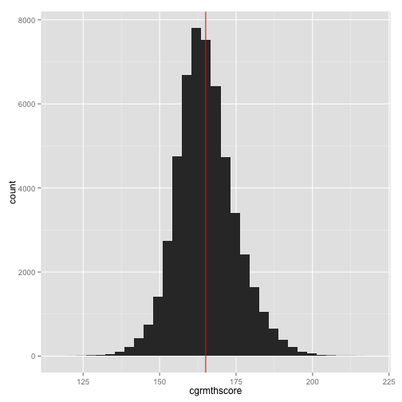
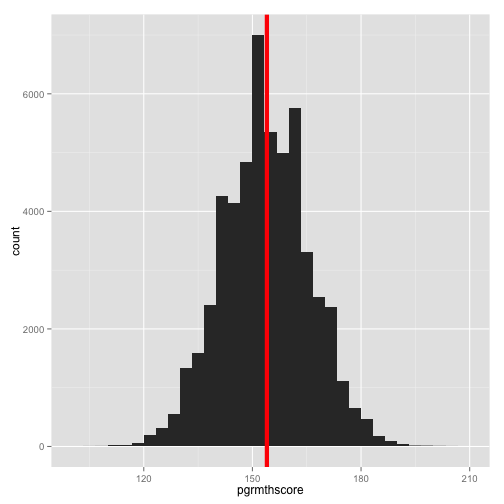
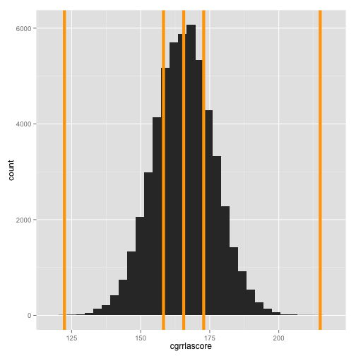
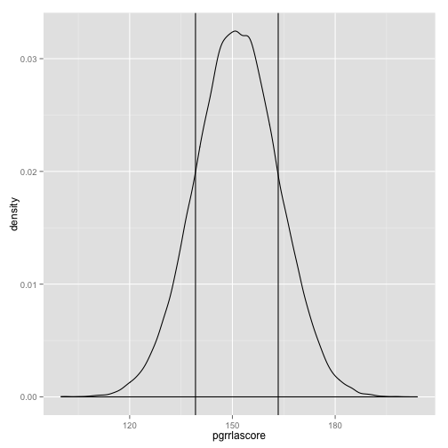

## Overview 
* Review:
    + Syllabus
* Describing Nominal/Ordinal Scale Data 
    + Frequencies
    + Proportions
    + Percentages
    + Cross tabulations
    + Finding the number of unique categories
* Describing Intervallic/Ratio Scale Data
    + Location
    + Deviance/Variance
    + Higher order parameters
* Next Class

---

## Review
* The lecture tonight is fairly compact, so I'll provide some time a bit later for you to ask some last minute questions related to the syntax
* Keep practicing the skills required to create graphs because you'll need to use it later in the semester

---   

## Loading Data into R
*If you need additional help for the next set of commands you can use `?table`, `?prop.table`, and `?round` to see the help files for each of these commands.


```r
library("foreign"); library("ggplot2")

# Load some data for the examples
yourData <- as.data.frame(read.dta(#
    "http://www.paces-consulting.org/stata/JSU/Fall2014/JohnDoe-task1.dta"))
```

---   

# Describing Nominal/Ordinal Scale Data
* Frequencies tell you the number of observations per category
* You can use the terms proportions and percentages interchangably when describing categorical data since you can only have up to 100% 
* Proportions tell you the ratio of the number of observations in that category compared to all observations
* The marginal proportions give you the proportions for based on the total number of observations per row/column in a cross tabulation
* Sometimes you'll also want to know the number of unique categories

---

## Frequencies


```r
table(yourData$race)
```

```
## 
##                               Asian           Black or African American 
##                                   5                               27413 
##                  Hispanic or Latino                   Two or More Races 
##                                 380                                   0 
##   American Indian or Alaskan Native Native Hawaiian or Pacific Islander 
##                                   0                                   0 
##                               White 
##                               25832
```

---   


```r
table(yourData$cgrrlalev)
```

```
## 
##    Minimal      Basic Proficient   Advanced 
##        315       3034      20770      25846
```

---   


```r
table(yourData$rlaprogram)
```

```
## 
## Did not participate in RLA Intervention 
##                                   30389 
##        Participated in RLA Intervention 
##                                   23241
```

---   

## Proportions


```r
prop.table(table(yourData$ed))
```

```
## 
## Not Economically Disadvantaged     Economically Disadvantaged 
##                           0.35                           0.65
```

---   


```r
prop.table(table(yourData$pgrmthlev))
```

```
## 
##    Minimal      Basic Proficient   Advanced 
##     0.1515     0.2174     0.4362     0.1948
```

---   


```r
prop.table(table(yourData$mthprogram))
```

```
## 
## Did not participate in Math Intervention 
##                                   0.6422 
##        Participated in Math Intervention 
##                                   0.3578
```

---

## Percentages

```r
prop.table(table(yourData$scd)) * 100
```

```
## 
## Non-Severe Cognitive Disability Student 
##                                  97.999 
##   Student w/Severe Cognitive Disability 
##                                   2.001
```

---   


```r
prop.table(table(yourData$female)) * 100
```

```
## 
##   Male Female 
##     51     49
```

---   

* You can round the values too


```r
# Put parentheses around everything before the comma to make sure it is
# evaluated first The number after the comma is how many digits past the
# decimal you'll get back
round((prop.table(table(yourData$mthprogram)) * 100), 1)
```

```
## 
## Did not participate in Math Intervention 
##                                     64.2 
##        Participated in Math Intervention 
##                                     35.8
```

---

## Cross-Tabulations of frequencies

```r
# Same as regular frequencies but separate the two variables with a comma
table(yourData$female, yourData$ed)
```

```
##         
##          Not Economically Disadvantaged Economically Disadvantaged
##   Male                             9678                      17673
##   Female                           9092                      17187
```

---   

## Cross-Tabulations of proportions

```r
# Same as regular proportions but separate the two variables with a comma
prop.table(table(yourData$female, yourData$ed))
```

```
##         
##          Not Economically Disadvantaged Economically Disadvantaged
##   Male                           0.1805                     0.3295
##   Female                         0.1695                     0.3205
```

---    

## Cross-Tabulations of percentages

```r
# Same as regular proportions but separate the two variables with a comma
prop.table(table(yourData$female, yourData$ed)) * 100
```

```
##         
##          Not Economically Disadvantaged Economically Disadvantaged
##   Male                            18.05                      32.95
##   Female                          16.95                      32.05
```

---  

## Finding the number of unique categories

```r
# Find the number of unique districts and schools
length(unique(yourData$distid))
```

```
## [1] 25
```

```r
length(unique(yourData$schid))
```

```
## [1] 182
```

---

## Describing Intervallic/Ratio Scale Data
### Location
* The mean and the average are the same
* The median is the value in the middle of the range of all the values (e.g., 50%)
* The maximum and minimum are the lowest and highest observed values

---   

### Deviance/Variance
* Variance and Standard Deviation describe how far values are spread from the mean - on average
* The interquartile range is like taking the median from the minimum to median values (e.g., 25%) and the median to maximum values (e.g., 75%)
* The standard deviation is the squared root of the variance; the Variance is the standard deviation squared; this tells you how far the values spread (on average) from the mean

---   

### High Order Moment Conditions

* Skewness indicates whether one tail of the distribution is longer than the other (e.g., whether or not the distribution is symmetrical)
* Kurtosis indicates whether or not the middle of the distribution is too flat or too sharp (e.g., too few observations in the middle or too many observations in the middle of the distribution)

---

## Location

```r
# The argument after the variable name means to exclude NA (not applicable)
# values
mean(yourData$cgrmthscore, na.rm = TRUE)
```

```
## [1] 165.1
```

```r
# Store the value of the mean to use it in a graph on the next slide
vertical <- mean(yourData$cgrmthscore, na.rm = TRUE)
```

---   


```r
# You can add it to a graph too (for a vertical line you need to use xintercept)
ggplot(yourData, aes(x = cgrmthscore)) + geom_histogram() + # 
    geom_vline(xintercept = vertical, color = "red")
```

 

---   


```r
# What happens if there are NA values and you don't use na.rm = TRUE?
someValues <- c(1, 3, 4, 9, 17, NA, 4, 4, 6)
mean(someValues)
```

```
## [1] NA
```

```r
mean(someValues, na.rm = TRUE)
```

```
## [1] 6
```

---


```r
# What happens if you try to calculate the mean of a nominal scale variable?
mean(yourData$race)
```

```
## Warning: argument is not numeric or logical: returning NA
```

```
## [1] NA
```

---   


```r
# Get the median - or 50th percentile - of a variable
median(yourData$pgrmthscore, na.rm = TRUE)
```

```
## [1] 154
```

```r
# You can also add the median value to a plot by storing it as well
vertical <- median(yourData$pgrmthscore, na.rm = TRUE)
```

---   


```r
# Using a different color and size you can make things easier to see
ggplot(yourData, aes(x = pgrmthscore)) + geom_histogram() + # 
    geom_vline(xintercept = vertical, size = 2, color = "red")
```

 

---


```r
# Get the median, interquartile range, and the minimum/maximum values
fivenum(yourData$cgrrlascore, na.rm = TRUE)
```

```
## [1] 122.4 158.3 165.6 172.8 215.0
```

```r
# If you wanted to see where all of these values are located you can do that
# too
multipleLines <- fivenum(yourData$cgrrlascore, na.rm = TRUE)
```

---


```r
# Graph the distribution with Tukey's Five Number Summary
ggplot(yourData, aes(x = cgrrlascore)) + geom_histogram() + # 
    geom_vline(xintercept = multipleLines, size = 2, color = "orange")
```

 

## Deviance/Variance


```r
# Get the standard deviation of a variable
sd(yourData$pgrrlascore, na.rm = TRUE)
```

```
## [1] 12.07
```

```r
# Store the standard deviation & the mean for the next graph
sds <- sd(yourData$pgrrlascore, na.rm = TRUE)
center <- mean(yourData$pgrrlascore, na.rm = TRUE)
```

--- 


```r
# Show 1 standard deviation around the mean
ggplot(yourData, aes(x = pgrrlascore)) + geom_density() + #
geom_vline(xintercept = center - sds) + geom_vline(xintercept = center + sds)
```

 

---


```r
# Get the variance of a variable
sd(yourData$pgrmthscore, na.rm = TRUE)^2
```

```
## [1] 142.8
```

--- 

## Higher order moments


