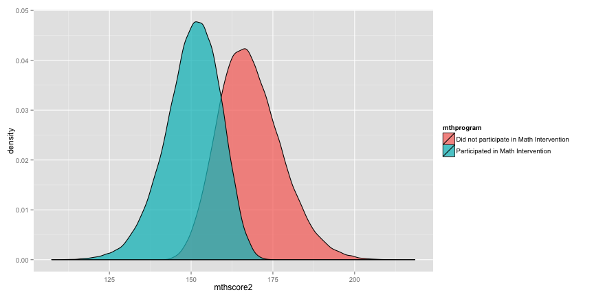

## Overview 
* Review
* Sources of error 
	+ Sample statistics and population parameters
    + Measurement
* Model Assumptions
	+ Equal variance, Independence
	+ Measurement Scale, Distribution of the Outcome
* Independent Samples t-Tests
	+ What is the null-hypothesis and how do you "test" a hypothesis?
    + What is a t-Test?, When to use a t-test?
    + Examples
* Next Class

---

## Review
* Explain in your own words, what `dplyr` is and what it is used for?
* What are some of the `dplyr` functions that you can use to aggregate/disaggregate data?
* How many people submitted their work from last week?  
* If you didn't turn in anything last week, and you haven't been participating in the
discussion boards regularly, you __will__ make it much more difficult on _yourself_ 
to earn a __B__.  
* If you want to make sure that you're able to _earn_ a decent grade and you 
_haven't_ participated on the discussion boards regularly, you __need__ to 
participate on the discussion boards __EVERY WEEK__ from this point forward 
__without exception__.  

---   


```r
# Load the foreign data package and the ggplot2 package
library("foreign"); library("ggplot2")

# Store the URL where the data can be accessed
url <- "http://www.paces-consulting.org/stata/JSU/Fall2014/"

# Load either your data or the example data (Substitute your name to get your data)
example <- as.data.frame(read.dta(paste0(url, "JohnDoe-task3.dta")))
```

---   

## Sources of error : Sample Statistics vs Population Parameters
* Sample statistics are used to __describe__ the data that you collected or that 
appear in your datasets
* Population parameters are __estimates__ of what we think the true value is in 
the population
* When you want to use statistics to generalize findings beyond the data you 
have on hand, you are making an __inference__ that should be based on your 
estimates of the population parameters
* When you only have a sample, your data can contain _random sampling error_ or 
_non-random sampling error_.  
* If your sample was selected completely at random, it will generally be pretty 
close to the true value in the population
* If your sample was not selected completely at random, it is less likely to be 
close to the true value in the population

---   

## Sources of error : Measurement
* One major source of error that we deal with in education on a regular basis is 
measurement error
* If we were measuring something simple, like the height of students, how likely 
do you think it would be that we would all get exactly the same answer?  
* What are some reasons that the measurements would not be identical?
* Now, imagine how much more difficult it is when you are trying to measure 
something that doesn't exist in the physical world, like reading/math
proficiency.
* What would happen if the tests that each district used had different levels of 
difficulty?  Could you compare those results accurately/reliably? Why/Why not?

---   

* You can think about measurement error as:
	+ error attributed to a lack of calibration in measurement methods (e.g., 
	everyone tells students to stand different when measuring height, some people
	use a tape measure while others use a yard stick, etc...)
	+ error attributed to a lack of calibration of measurement tools (e.g., 
	everyone uses a different yard stick, but no one checks to make sure the 
	marks occur at the same place)
	+ error attributed to a lack of precision (e.g., measuring the length of a 
	football field with a 12" ruler would not be likely to give the same result
	from using land surveying tools)
	+ error attributed to a lack of reliability (e.g., if you took the exact 
	same measurement 5 minutes later the result would not be the same)
* These are all things that __need__ to be considered when analyzing data

---   

## Model Assumptions
* Model assumptions are things that you are willing to _assume are true_ about 
your data, parameters, and model in order to obtain valid results
* Many times, these assumptions are violated, in which case we need to find ways 
to work around them
	+ For example, almost all statistical methods assume the data come from a 
	random sample, but in the field of education, we rarely - if ever - work 
	with a random sample of data
* For t-Tests there are two related assumptions that you need to consider: 
1.) Equality of variance; & 2.) 

---

# Equality of Variance
* A t-Test expects that the _variances_ - or the average amount the data are 
spread from the mean - will be equal across both groups
* The few different statistical procedures that exist to test this assumption 
generally perform poorly unless you have unreasonably large group sizes
* R uses a correction (Welch's t-Test) to deal with cases where this assumption 
is violated
* Other software will sometimes use alternative methods to deal with the same 
issue, in particular the Saterthwaite correction is fairly common as well
* So, how would you know whether or not the assumption is true or might be true?  
* Although it's not the most "scientific", one way to get some idea of whether 
or not the assumption holds is to graph the distribution(s) of the data for the 
groups

---   


```r
# Create a graph of the distributions
ggplot(data = example, aes(x = mthscore2)) + #
geom_density(mapping = aes(fill = mthprogram), alpha=I(.75)) 
```



---   

# Independance
* Although the graph on the previous slide shows the distribution of scores from 
distinct groups, are students in the same classrooms, same schools, and same 
districts really independent of one another?
* Ideally, the two groups would be defined by randomly assigning students to one 
group or the other, but that is extremely rare in education
* In general, this means that your _standard errors_ - or your __margin of error__ - 
will not be completely accurate (e.g., it will generally be too large if the 
observations are clustered or grouped)

---   

# Outcome scale & Distribution of the outcome
* For t-Tests, your outcome should be an intervallic or ratio scale variable
* In other words, you wouldn't use a t-Test for proficiency levels, or nominal 
scale variables like race, because there wouldn't be any way to interpret the _mean_
* If you graphed the data above using your own data, you would be able to see
how normal/non-normal things are

---   

* Some additional strategies that you could/should use to determine whether the 
data are normally - or Gaussian - distributed is to estimate the skewness and 
kurtosis for your outcome


```r
# Load the moments package to get skewness and kurtosis functions
library("moments")

# Get the skewness and kurtosis
skewness(example$mthscore2, na.rm = TRUE) 
```

```
## [1] 0.02287
```

```r
kurtosis(example$mthscore2, na.rm = TRUE)
```

```
## [1] 3.059
```

---   

## Independent Samples t-Tests
* Independent Samples t-Tests are used to test whether the __means__ of __TWO__ 
groups are statistically different from 0 (or no difference)
* It is a method typically used in experimental designs where participants can 
be randomly assigned to a treatment or controll group
* Using it in a non-random context, it would not be a good idea to discuss any 
type of _causal_ effect; Instead, you could treat it like a way of describing 
the differences that you observe in the data and/or that may exist in the population

---   

# What is the null-hypothesis and how do you "test" a hypothesis?
* A hypothesis is a statement that can be answered with a true/false response
	+ Males score higher, on average, than females on the math assessment in grade 3
	+ Students participating in the Reading intervention scored higher - on average - compared to students who did not participate in the intervention
* The null-hypothesis is the negative form of your hypothesis:
	+ Males __do not__ score higher than females on the 3rd grade math assessment on average
	+ There is __no difference__ in reading scores between students who did/did not participate in the reading intervention
* For cases like this, your hypothesis can be tested using a t-test, although other hypotheses may require different techniques/algorithms

---   

## What is a t-Test?
* The t-test is a comparison of the difference of the means of __TWO GROUPS__ 
* It requires __ONE CONTINUOUS__ scale outcome and __ONE NOMINAL__ scale indicator for the __TWO GROUPS__
* The purpose is to quantify whether or not the difference exists purely by chance 
* The probability of occuring by chance is represented as a _p-value_
	+ values < 0.05 mean the difference would occur less than 5% of the time by chance alone
	+ values > 0.05 mean the difference would occur by chance more than 5% of the time
* This can be helpful to identify whether or not a difference is statistically meaningful, but whether or not the difference is practically meaningful should come from your experience/research literature	

---   

## When to use a t-test?
* The t-Test should only be used when you have __exactly TWO GROUPS__ to compare
* If you have 3 or more groups to compare, __DO NOT USE A t-TEST__
* Use a t-test if you want to get a better understanding of whether or not differences are likely to be completely random in nature vs the result of some non-random phenomena
* Use a t-Test when you want to make statements about the _population_ based on your _sample_ of data

---    

## Examples

```r
# Test first hypothesis example
t.test(mthscore2 ~ sex, data = example, subset = currentGrade == 3, na.action = na.omit)
```

```
## 
## 	Welch Two Sample t-test
## 
## data:  mthscore2 by sex
## t = 7.7, df = 21234, p-value = 1.417e-14
## alternative hypothesis: true difference in means is not equal to 0
## 95 percent confidence interval:
##  0.9855 1.6585
## sample estimates:
##   mean in group Male mean in group Female 
##                162.6                161.3
```

---   


```r
# Test second hypothesis example
t.test(rlascore2 ~ rlaprogram, data = example, na.action = na.omit)
```

```
## 
## 	Welch Two Sample t-test
## 
## data:  rlascore2 by rlaprogram
## t = 188.3, df = 113756, p-value < 2.2e-16
## alternative hypothesis: true difference in means is not equal to 0
## 95 percent confidence interval:
##  11.61 11.86
## sample estimates:
## mean in group Did not participate in RLA Intervention 
##                                                 162.8 
##        mean in group Participated in RLA Intervention 
##                                                 151.1
```

---   

## Next Class
* Paired, or dependent, Samples t-Tests
* You will get some time to finish Task III next class, but you should have the majority finished
* The data you have now is beginning to look slightly more realistic.  This means you will have missing data, so it is up to you to review examples where I've shown how to remove missing values in your calculations


